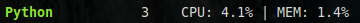
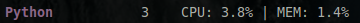
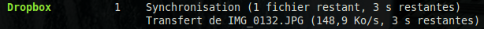
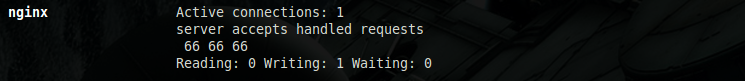

.. _amps:

Applications Monitoring Process
===============================

Thanks to Glances and its AMP module, you can add specific monitoring to
running processes. AMPs are defined in the Glances [configuration file](http://glances.readthedocs.io/en/stable/config.html).

You can disable AMP using the ``--disable-plugin amps`` option or pressing the
``A`` key.

Simple AMP
----------

For example, a simple AMP that monitor the CPU/MEM of all Python
processes can be defined as follows:

.. code-block:: ini

    [amp_python]
    enable=true
    regex=.*python.*
    refresh=3

Every 3 seconds (``refresh``) and if the ``enable`` key is true, Glances
will filter the running processes list thanks to the ``.*python.*``
regular expression (``regex``).

The default behavior for an AMP is to display the number of matching
processes, CPU and MEM:

You can also define the minimum (``countmin``) and/or maximum
(``countmax``) process number. For example:

.. code-block:: ini

    [amp_python]
    enable=true
    regex=.*python.*
    refresh=3
    countmin=1
    countmax=2

With this configuration, if the number of running Python scripts is
higher than 2, then the AMP is displayed with a purple color (red if
less than countmin):

User defined AMP
----------------

If you need to execute a specific command line, you can use the
``command`` option. For example, if you want to display the Dropbox
process status, you can define the following section in the Glances
configuration file:

.. code-block:: ini

    [amp_dropbox]
    # Use the default AMP (no dedicated AMP Python script)
    enable=true
    regex=.*dropbox.*
    refresh=3
    one_line=false
    command=dropbox status
    countmin=1

The ``dropbox status`` command line will be executed and displayed in
the Glances UI:

You can force Glances to display the result in one line setting
``one_line`` to true.

Embedded AMP
------------

Glances provides some specific AMP scripts (replacing the ``command``
line). You can write your own AMP script to fill your needs. AMP scripts
are located in the ``amps`` folder and should be named ``glances_*.py``.
An AMP script define an Amp class (``GlancesAmp``) with a mandatory
update method. The update method call the ``set_result`` method to set
the AMP return string. The return string is a string with one or more
line (\n between lines). To enable it, the configuration file section
should be named ``[amp_*]``.

For example, if you want to enable the Nginx AMP, the following
definition should do the job (Nginx AMP is provided by the Glances team
as an example):

.. code-block:: ini

    [amp_nginx]
    enable=true
    regex=\/usr\/sbin\/nginx
    refresh=60
    one_line=false
    status_url=http://localhost/nginx_status

Here's the result:

In client/server mode, the AMP list is defined on the server side.
