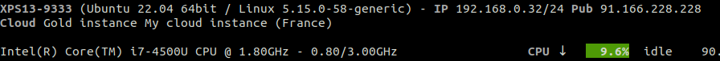

.. _cloud:

CLOUD
=====

This plugin displays information about the cloud provider if your host is running on OpenStack.

The plugin use the standard OpenStack `metadata`_ service to retrieve the information.

This plugin is disable by default, please use the --enable-plugin cloud option
to enable it.

.. _metadata: https://docs.openstack.org/nova/latest/user/metadata.html