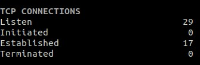

.. _connections:

Connections
===========

This plugin display extended information about network connections.

The states are the following:

- Listen: all ports created by server and waiting for a client to connect
- Initialized: All states when a connection is initialized (sum of SYN_SENT and SYN_RECEIVED)
- Established: All established connections between a client and a server
- Terminated: All states when a connection is terminated (FIN_WAIT1, CLOSE_WAIT, LAST_ACK, FIN_WAIT2, TIME_WAIT and CLOSE)
- Tracked: Current number and maximum Netfilter tracker connection (nf_conntrack_count/nf_conntrack_max)

The configuration should be done in the ``[connections]`` section of the
Glances configuration file.

By default the plugin is **disabled**. Please change your configuration file as following to enable it

.. code-block:: ini

    [connections]
    disable=False
    # nf_conntrack thresholds in %
    nf_conntrack_percent_careful=70
    nf_conntrack_percent_warning=80
    nf_conntrack_percent_critical=90
