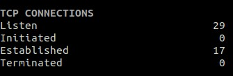

.. _connections:

Connections
===========

This plugin display extended information about network connections.

The states are the following:

- Listen: all ports created by server and waiting for a client to connect
- Initialized: All states when a connection is initialized (sum of SYN_SENT and SYN_RECEIVED)
- Established: All established connections between a client and a server
- Terminated: All states when a connection is terminated (FIN_WAIT1, CLOSE_WAIT, LAST_ACK, FIN_WAIT2, TIME_WAIT and CLOSE)
- Tracked: Current number and maximum Netfilter tracker connection (nf_conntrack_count/nf_conntrack_max)

The configuration should be done in the ``[connections]`` section of the
Glances configuration file.

By default the plugin is **disabled**. Please change your configuration file as following to enable it

.. code-block:: ini

    [connections]
    disable=False
    # nf_conntrack thresholds in %
    nf_conntrack_percent_careful=70
    nf_conntrack_percent_warning=80
    nf_conntrack_percent_critical=90

.. note::

    The ``connections`` plugin is **disabled by default** (``disable=True``)
    because scanning the full connection table is CPU-heavy. Only
    ``nf_conntrack_percent`` carries thresholds/alerts (default
    careful/warning/critical: 70/80/90%); the ``Listen``, ``Initiated``,
    ``Established`` and ``Terminated`` counters are informational only and
    are never alerted on. ``Initiated`` (SYN_SENT + SYN_RECV) and
    ``Terminated`` (FIN_WAIT1, FIN_WAIT2, TIME_WAIT, CLOSE, CLOSE_WAIT,
    LAST_ACK) are independent aggregates. Netfilter conntrack tracking
    (the ``Tracked`` row) is optional and only shown when the
    ``/proc/sys/net/netfilter/nf_conntrack_*`` counters are readable on
    the host.

.. warning::

    **Fixed in Glances v5 — ``Terminated`` was a duplicate of ``Initiated``.**

    In Glances v4, the loop that computes ``Terminated`` iterates the wrong
    state list (``initiated_states`` instead of ``terminated_states``), so
    v4's ``Terminated`` is an exact copy of ``Initiated`` and always
    under-reports. Glances v5 counts the real terminating states
    (FIN_WAIT1, FIN_WAIT2, TIME_WAIT, CLOSE, CLOSE_WAIT, LAST_ACK).

    Expect the displayed ``Terminated`` value to jump by an order of
    magnitude after upgrading: ``Initiated`` (SYN_SENT + SYN_RECV) is
    usually near zero, whereas ``TIME_WAIT`` alone is commonly in the
    hundreds. The new value is the correct one.
