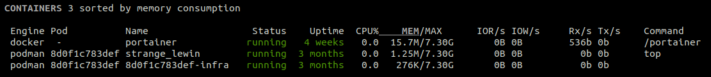

.. _containers:

Containers
==========

If you use ``containers``, Glances can help you to monitor your Docker or Podman containers.
Glances uses the containers API through the `docker-py`_ and `podman-py`_ libraries.

You can install this dependency using:

.. code-block:: console

    pip install glances[containers]

Note: Memory usage is compute as following "display memory usage = memory usage - inactive_file"

It is possible to define limits and actions from the configuration file
under the ``[containers]`` section:

.. code-block:: ini

    [containers]
    disable=False
    # Only show specific containers (comma-separated list of container name or regular expression)
    show=thiscontainer,andthisone,andthoseones.*
    # Hide some containers (comma-separated list of container name or regular expression)
    hide=donotshowthisone,andthose.*
    # Show only specific containers (comma-separated list of container name or regular expression)
    #show=showthisone,andthose.*
    # Define the maximum containers size name (default is 20 chars)
    max_name_size=20
    # List of stats to disable (not display)
    # Following stats can be disabled: name,status,uptime,cpu,mem,diskio,networkio,command
    disable_stats=diskio,networkio
    # Global containers' thresholds for CPU and MEM (in %)
    cpu_careful=50
    cpu_warning=70
    cpu_critical=90
    mem_careful=20
    mem_warning=50
    mem_critical=70
    # Per container thresholds
    containername_cpu_careful=10
    containername_cpu_warning=20
    containername_cpu_critical=30
    containername_cpu_critical_action=echo {{Image}} {{Id}} {{cpu}} > /tmp/container_{{name}}.alert
    # By default, Glances only display running containers
    # Set the following key to True to display all containers
    all=False
    # Define Podman sock
    #podman_sock=unix:///run/user/1000/podman/podman.sock

You can use all the variables ({{foo}}) available in the containers plugin.

Filtering (for hide or show) is based on regular expression. Please be sure that your regular
expression works as expected. You can use an online tool like `regex101`_ in
order to test your regular expression.

.. _regex101: https://regex101.com/
.. _docker-py: https://github.com/containers/containers-py
.. _podman-py: https://github.com/containers/podman-py