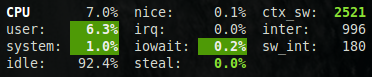

.. _cpu:

CPU
===

The CPU stats are shown as a percentage or values and for the configured
refresh time.

The total CPU usage is displayed on the first line.

.. image:: ../_static/cpu.png

If enough horizontal space is available, extended CPU information are
displayed.

CPU stats description:

- **user**: percent time spent in user space. User CPU time is the time
  spent on the processor running your program's code (or code in
  libraries).
- **system**: percent time spent in kernel space. System CPU time is the
  time spent running code in the Operating System kernel.
- **idle**: percent of CPU used by any program. Every program or task
  that runs on a computer system occupies a certain amount of processing
  time on the CPU. If the CPU has completed all tasks it is idle.
- **nice** *(\*nix)*: percent time occupied by user level processes with
  a positive nice value. The time the CPU has spent running users'
  processes that have been *niced*.
- **irq** *(Linux, \*BSD)*: percent time spent servicing/handling
  hardware/software interrupts. Time servicing interrupts (hardware +
  software).
- **iowait** *(Linux)*: percent time spent by the CPU waiting for I/O
  operations to complete.
- **steal** *(Linux)*: percentage of time a virtual CPU waits for a real
  CPU while the hypervisor is servicing another virtual processor.
- **guest** *(Linux)*: percentage of time a virtual CPU spends
  servicing another virtual CPU under the control of the Linux kernel.
- **ctx_sw**: number of context switches (voluntary + involuntary) per
  second. A context switch is a procedure that a computer's CPU (central
  processing unit) follows to change from one task (or process) to
  another while ensuring that the tasks do not conflict.
- **inter**: number of interrupts per second.
- **sw_inter**: number of software interrupts per second. Always set to
  0 on Windows and SunOS.
- **syscal**: number of system calls per second. Do not displayed on
  Linux (always 0).
- **dpc**: *(Windows)*: time spent servicing deferred procedure calls.

To switch to per-CPU stats, just hit the ``1`` key:

.. image:: ../_static/per-cpu.png

In this case, Glances will show on line per logical CPU on the system.
If you have multiple core, it is possible to define the maximum number
of CPU to display. The top 'max_cpu_display' will be display and an
extra line with the mean of all others CPU will be added.

.. code-block:: ini

  [percpu]
  # Define the maximum number of CPU display at a time
  # If the number of CPU is higher than:
  # - display the top 'max_cpu_display' (sorted by CPU consumption)
  # - a last line will be added with the sum of all other CPUs
  max_cpu_display=4

Logical cores means the number of physical cores multiplied by the number
of threads that can run on each core (this is known as Hyper Threading).

By default, ``steal`` CPU time alerts aren't logged. If you want that,
just add to the configuration file:

.. code-block:: ini

    [cpu]
    steal_log=True

Legend:

================= ============
CPU (user/system) Status
================= ============
``<50%``          ``OK``
``>50%``          ``CAREFUL``
``>70%``          ``WARNING``
``>90%``          ``CRITICAL``
================= ============

.. note::
    Limit values can be overwritten in the configuration file under
    the ``[cpu]`` and/or ``[percpu]`` sections.
