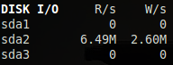

.. _disk:

Disk I/O
========

Glances displays the disk I/O throughput. The unit is adapted
dynamically.

You can display:

- bytes per second (default behavior / Bytes/s, KBytes/s, MBytes/s, etc)
- requests per second (using --diskio-iops option or *B* hotkey)

There is no alert on this information.

It's possible to define:

- a list of disk to show (white list)
- a list of disks to hide
- aliases for disk name

under the ``[diskio]`` section in the configuration file.

For example, if you want to hide the loopback disks (loop0, loop1, ...)
and the specific ``sda5`` partition:

.. code-block:: ini

    [diskio]
    hide=sda5,loop.*

or another example:

.. code-block:: ini

    [diskio]
    show=sda.*

Filtering is based on regular expression. Please be sure that your regular
expression works as expected. You can use an online tool like `regex101`_ in
order to test your regular expression.

It is also possible to define thesholds for bytes read and write per second:

.. code-block:: ini

    [diskio]
    # Alias for sda1 and sdb1
    #alias=sda1:SystemDisk,sdb1:DataDisk
    # Set thresholds (in bytes per second) for a given disk name (rx = read / tx = write)
    dm-0_rx_careful=4000000000
    dm-0_rx_warning=5000000000
    dm-0_rx_critical=6000000000
    dm-0_rx_log=True
    dm-0_tx_careful=700000000
    dm-0_tx_warning=900000000
    dm-0_tx_critical=1000000000
    dm-0_tx_log=True

You also can automatically hide disk with no read or write using the
``hide_zero`` configuration key. The optional ``hide_threshold_bytes`` option
can also be used to set a threshold higher than zero.

.. code-block:: ini

    [diskio]
    hide_zero=True
    hide_threshold_bytes=0

.. _regex101: https://regex101.com/