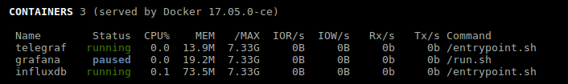

.. _docker:

Docker
======

If you use ``Docker``, Glances can help you to monitor your containers.
Glances uses the Docker API through the `docker-py`_ library.

You can install this dependency using:

.. code-block:: console

    pip install glances[docker]

It is possible to define limits and actions from the configuration file
under the ``[docker]`` section:

.. code-block:: ini

    [docker]
    # Global containers' thresholds for CPU and MEM (in %)
    cpu_careful=50
    cpu_warning=70
    cpu_critical=90
    mem_careful=20
    mem_warning=50
    mem_critical=70
    # Per container thresholds
    containername_cpu_careful=10
    containername_cpu_warning=20
    containername_cpu_critical=30
    containername_cpu_critical_action=echo {{Image}} {{Id}} {{cpu}} > /tmp/container_{{name}}.alert
    # By default, Glances only display running containers
    # Set the following key to True to display all containers
    all=False

You can use all the variables ({{foo}}) available in the Docker plugin.

.. _docker-py: https://github.com/docker/docker-py
