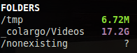

.. _folders:

Folders
=======

The folders plugin allows user, through the configuration file, to
monitor size of a predefined folders list.

If the size cannot be computed, a ``'?'`` (non-existing folder) or a
``'!'`` (permission denied) is displayed.

Each item is defined by:

- ``path``: absolute path to monitor (mandatory)
- ``careful``: optional careful threshold (in MB)
- ``warning``: optional warning threshold (in MB)
- ``critical``: optional critical threshold (in MB)
- ``refresh``: interval in second between two refresh (default is 30 seconds)

Up to ``10`` items can be defined.

For example, if you want to monitor the ``/tmp`` folder every minute,
the following definition should do the job:

.. code-block:: ini

    [folders]
    folder_1_path=/tmp
    folder_1_careful=2500
    folder_1_warning=3000
    folder_1_critical=3500
    folder_1_refresh=60

In client/server mode, the list is defined on the ``server`` side.

.. warning::
    Symbolic links are not followed.

.. warning::
    Do **NOT** define folders containing lot of files and subfolders or use an
    huge refresh time...
