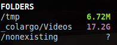

.. _folders:

Folders
=======

The folders plugin allows user, through the configuration file, to
monitor size of a predefined folders list.

If the size cannot be computed, a ``'?'`` (non-existing folder) or a
``'!'`` (permission denied) is displayed.

Each item is defined by:

- ``path``: absolute path to monitor (mandatory)
- ``careful``: optional careful threshold (in MB)
- ``warning``: optional warning threshold (in MB)
- ``critical``: optional critical threshold (in MB)
- ``refresh``: interval in second between two refresh (default is 30 seconds)

Up to ``10`` items can be defined.

For example, if you want to monitor the ``/tmp`` folder every minute,
the following definition should do the job:

.. code-block:: ini

    [folders]
    folder_1_path=/tmp
    folder_1_careful=2500
    folder_1_warning=3000
    folder_1_critical=3500
    folder_1_refresh=60

In client/server mode, the list is defined on the ``server`` side.

.. warning::
    Symbolic links are not followed.

.. warning::
    Do **NOT** define folders containing lot of files and subfolders or use an
    huge refresh time...

.. note::

    Since Glances v5, each folder's ``careful``/``warning``/``critical``
    threshold (in MB) is converted to bytes and compared against that
    folder's own size — thresholds are per folder, not global. A folder
    that cannot be read (non-existent path, permission denied) always
    short-circuits the size thresholds and is shown with a leading ``?``.
    That folder raises **no alert** (mirrors v4: no history entry, no
    action dispatch) and is displayed **bold, with no colour**, rather
    than colour-coded by the size ladder. The plugin otherwise feeds the
    alert history (``EMITS_ALERTS=True``, mirrors v4) and is displayed in
    the TUI's left sidebar.

.. warning::

    **Breaking change in Glances v5 — per-folder actions are keyed by path,
    not by index.**

    Glances v4 keyed threshold actions by the folder's position in the
    configuration file::

        folder_1_critical_action=notify-send "disk full"

    Glances v5 keys every action by the field it belongs to, so the folder's
    own path replaces the index::

        /media/backup_size_critical_action=notify-send "disk full"

    The v4 form is no longer read. Update any
    ``folder_<N>_<level>_action`` key to the new shape, otherwise the action
    is silently ignored. The available levels are ``careful``, ``warning``
    and ``critical``.

    **The path must be written in lower case.** Configuration option names
    are lower-cased when the file is read, so a key containing an upper-case
    character can never be matched and the action is silently ignored::

        # WRONG — never matches, whatever the folder is called
        /home/user/Videos_size_critical_action=notify-send "full"
        # RIGHT
        /home/user/videos_size_critical_action=notify-send "full"

    This affects any folder whose path is not already lower case
    (``~/Videos``, ``~/Documents``, ``~/Downloads``, ``/Users/Name/...`` on
    macOS).
