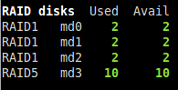

.. _fs:

File System
===========

.. image:: ../_static/fs.png

Glances displays the used and total file system disk space. The unit is
adapted dynamically.

Alerts are set for `user disk space usage <https://psutil.readthedocs.io/en/latest/index.html?highlight=disk%20usage#psutil.disk_usage>`_.

Legend:

===================== ============
User disk space usage Status
===================== ============
``<50%``              ``OK``
``>50%``              ``CAREFUL``
``>70%``              ``WARNING``
``>90%``              ``CRITICAL``
===================== ============

.. note::
    Limit values can be overwritten in the configuration file under
    the ``[filesystem]`` section.

By default, the plugin only displays physical devices (hard disks, USB
keys). To allow other file system types, you have to enable them in the
configuration file. For example, if you want to allow the ``shm`` file
system:

.. code-block:: ini

    [fs]
    allow=shm

Also, you can hide mount points as well (in the following ``/boot``):

.. code-block:: ini

    [fs]
    hide=/boot.*

Filtering can also be done on device name (Glances 3.1.4 or higher):

.. code-block:: ini

     [fs]
     hide=/dev/sdb2

RAID
----

*Availability: Linux*

Thanks to the `pymdstat`_ library, if a ``RAID`` controller is detected
on your system, its status will be displayed as well:

.. _pymdstat: https://github.com/nicolargo/pymdstat
