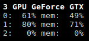

.. _gpu:

GPU
===

For the moment, only following GPU are supported:
- NVidia (thanks to the `nvidia-ml-py`_ library)
- AMD (only on Linux Operating system with kernel 5.14 or higher)

The GPU stats are shown as a percentage of value and for the configured
refresh time. It displays:

- total GPU usage
- memory consumption
- temperature

.. image:: ../_static/gpu.png

If you click on the ``6`` short key, the per-GPU view is displayed:

.. note::
    You can also start Glances with the ``--meangpu`` option to display
    the first view by default.

You can change the threshold limits in the configuration file:

.. code-block:: ini

    [gpu]
    # Default processor values if not defined: 50/70/90
    proc_careful=50
    proc_warning=70
    proc_critical=90
    # Default memory values if not defined: 50/70/90
    mem_careful=50
    mem_warning=70
    mem_critical=90
    # Temperature
    temperature_careful=60
    temperature_warning=70
    temperature_critical=80

Legend:

============== ============
GPU (PROC/MEM) Status
============== ============
``<50%``       ``OK``
``>50%``       ``CAREFUL``
``>70%``       ``WARNING``
``>90%``       ``CRITICAL``
============== ============

.. _nvidia-ml-py: https://pypi.org/project/nvidia-ml-py/
