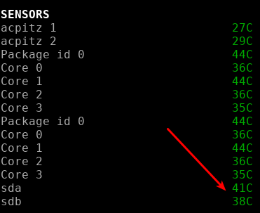

.. _sensors:

HDD temperature sensor
======================

*Availability: Linux*

This plugin will add HDD temperature to the sensors plugin.

On your Linux system, you will need to have:
- hddtemp package installed
- hddtemp service up and running (check it with systemctl status hddtemp)
- the TCP port 7634  opened on your local firewall (if it is enabled on your system)

For example on a CentOS/Redhat Linux operating system, you have to:

    $ sudo yum install hddtemp

    $ sudo systemctl enable hddtemp

    $ sudo systemctl enable hddtemp

Test it in the console:

    $ hddtemp

    /dev/sda: TOSHIBA MQ01ACF050: 41°C

    /dev/sdb: ST1000LM044 HN-M101SAD: 38°C

It should appears in the sensors plugin.

There is no alert on this information.

.. note::
    Limit values and sensors alias names can be defined in the
    configuration file under the ``[sensors]`` section.
