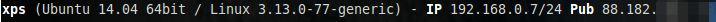
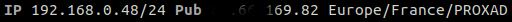
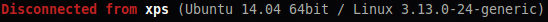
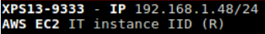

.. _header:

Header
======

The header shows the hostname, OS name, release version, platform
architecture IP addresses (private and public) and system uptime.
Additionally, on GNU/Linux, it also shows the kernel version.

In client mode, the server connection status is also displayed.

The system information message can be configured in the configuration file
(for the moment, it only work for the Curses interface):

.. code-block:: ini
    [system]
    # System information to display (a string where {key} will be replaced by the value) in the Curses interface
    # Available dynamics information are: hostname, os_name, os_version, os_arch, linux_distro, platform
    system_info_msg= | My {os_name} system |

The header IP message can be configured from the ip ``[ip]`` section, it allows to display private and
public IP information.

In the default configuration file, public IP address information is disable. Set public_disabled, to False
in order to enable the feature.

Example:

.. code-block:: ini

    [ip]
    # Disable display of private IP address
    disable=False
    # Configure the online service where public IP address information will be downloaded
    # - public_disabled: Disable public IP address information (set to True for offline platform)
    # - public_refresh_interval: Refresh interval between to calls to the online service
    # - public_api: URL of the API (the API should return an JSON object)
    # - public_username: Login for the online service (if needed)
    # - public_password: Password for the online service (if needed)
    # - public_field: Field name of the public IP address in onlibe service JSON message
    # - public_template: Template to build the public message
    #
    # Example for IPLeak service:
    # public_api=https://ipv4.ipleak.net/json/
    # public_field=ip
    # public_template={ip} {continent_name}/{country_name}/{city_name}
    #
    public_disabled=False
    public_refresh_interval=300
    public_api=https://ipv4.ipleak.net/json/
    #public_username=<myname>
    #public_password=<mysecret>
    public_field=ip
    public_template={continent_name}/{country_name}/{city_name}

**NOTE:** Setting low values for `public_refresh_interval` will result in frequent
HTTP requests to the onlive service defined in public_api. Recommended range: 120-600 seconds.
Glances uses online services in order to get the IP addresses and the additional information.
Your IP address could be blocked if too many requests are done.

Example:

**Connected**:

.. image:: ../_static/connected.png

**Disconnected**:

If you are hosted on an ``OpenStack`` instance, some additional
information can be displayed (AMI-ID, region).

