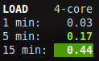
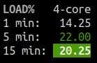

.. _load:

Load
====

*Availability: Unix and Windows with a PsUtil version >= 5.6.2*

On the *No Sheep* blog, Zachary Tirrell defines the `load average`_
on GNU/Linux operating system:

    "In short it is the average sum of the number of processes
    waiting in the run-queue plus the number currently executing
    over 1, 5, and 15 minutes time periods."

Be aware that Load on Linux, BSD and Windows are different things, high
`load on BSD`_ does not means high CPU load. The Windows load is emulated
by the PsUtil lib (see `load on Windows`_)

Glances gets the number of CPU core (displayed on the first line) to adapt
the alerts. Alerts on load average are only set on 15 minutes time period.

Thresholds are computed by dividing the 5 and 15 minutes average load per
CPU(s) number. For example, if you have 4 CPUs and the 5 minutes load is
1.0, then the warning threshold will be set to 2.8 (0.7 * 4 * 1.0).

From Glances 3.1.4, if Irix/Solaris mode is off ('0' key), the value is
divided by logical core number and multiple by 100 to have load as a
percentage.

A character is also displayed just after the LOAD header and shows the
trend value (for the 1 minute load stat):

======== ==============================================================
Trend    Status
======== ==============================================================
``-``    Mean 15 lasts values equal mean 15 previous values
``↓``    Mean 15 lasts values is lower mean 15 previous values
``↑``    Mean 15 lasts values is higher mean 15 previous values
======== ==============================================================

Legend:

============= ============
Load avg      Status
============= ============
``<0.7*core`` ``OK``
``>0.7*core`` ``CAREFUL``
``>1*core``   ``WARNING``
``>5*core``   ``CRITICAL``
============= ============

.. note::
    Limit values can be overwritten in the configuration file under
    the ``[load]`` section.

.. _load average: http://nosheep.net/story/defining-unix-load-average/
.. _load on BSD: http://undeadly.org/cgi?action=article&sid=20090715034920
.. _load on Windows: https://psutil.readthedocs.io/en/latest/#psutil.getloadavg
