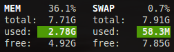
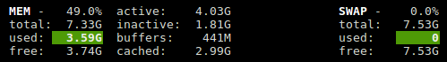

.. _memory:

Memory
======

Glances uses two columns: one for the ``RAM`` and one for the ``SWAP``.

If enough space is available, Glances displays extended information for
the ``RAM``:

Stats description:

- **percent**: the percentage usage calculated as (total-available)/total*100.
- **total**: total physical memory available.
- **used**: memory used, calculated differently depending on the platform and
  designed for informational purposes only.
  It's compute as following:
   used memory = total - free (with free = available + buffers + cached)
- **free**: memory not being used at all (zeroed) that is readily available;
  note that this doesn’t reflect the actual memory available (use ‘available’
  instead).
- **active**: (UNIX): memory currently in use or very recently used, and so it
  is in RAM.
- **inactive**: (UNIX): memory that is marked as not used.
- **buffers**: (Linux, BSD): cache for things like file system metadata.
- **cached**: (Linux, BSD): cache for various things.

Additional stats available in through the API:

- **available**: the actual amount of available memory that can be given
  instantly to processes that request more memory in bytes; this is calculated
  by summing different memory values depending on the platform (e.g. free +
  buffers + cached on Linux) and it is supposed to be used to monitor actual
  memory usage in a cross platform fashion.
- **wired**: (BSD, macOS): memory that is marked to always stay in RAM. It is
  never moved to disk.
- **shared**: (BSD): memory that may be simultaneously accessed by multiple
  processes.

A character is also displayed just after the MEM header and shows the
trend value:

======== ==============================================================
Trend    Status
======== ==============================================================
``-``    Mean 15 lasts values equal mean 15 previous values
``↓``    Mean 15 lasts values is lower mean 15 previous values
``↑``    Mean 15 lasts values is higher mean 15 previous values
======== ==============================================================

Alerts are only set for used memory and used swap.

Legend:

======== ============
RAM/Swap Status
======== ============
``<50%`` ``OK``
``>50%`` ``CAREFUL``
``>70%`` ``WARNING``
``>90%`` ``CRITICAL``
======== ============

.. note::
    Limit values can be overwritten in the configuration file under
    the ``[memory]`` and/or ``[memswap]`` sections.
