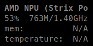

.. _npu:

NPU
===

Note: this plugin is disable by default in glances.conf file.

For the moment, only following NPU are supported on modern Linux Kernel:
- AMD: frequency
- INTEL: frequency, temperature
- ROCKSHIP: load, frequency

.. code-block:: ini

    [npu]
    disable=False
    # Default NPU load thresholds in %
    load_careful=50
    load_warning=70
    load_critical=90
    # Default NPU frequency thresholds in %
    freq_careful=50
    freq_warning=70
    freq_critical=90
