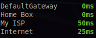

.. _ports:

Ports
=====

*Availability: All*

This plugin aims at providing a list of hosts/port to scan.

You can define ICMP or TCP ports scan.

The list should be define in the ``[ports]`` section of the Glances configuration file.

.. code-block:: ini

    [ports]
    # Ports scanner plugin configuration
    # Interval in second between two scans
    refresh=30
    # Set the default timeout (in second) for a scan (can be overwrite in the scan list)
    timeout=3
    # If port_default_gateway is True, add the default gateway on top of the scan list
    port_default_gateway=True
    # Define the scan list (1 < x < 255)
    # port_x_host (name or IP) is mandatory
    # port_x_port (TCP port number) is optional (if not set, use ICMP)
    # port_x_description is optional (if not set, define to host:port)
    # port_x_timeout is optional and overwrite the default timeout value
    # port_x_rtt_warning is optional and defines the warning threshold in ms
    port_1_host=192.168.0.1
    port_1_port=80
    port_1_description=Home Box
    port_1_timeout=1
    port_2_host=www.free.fr
    port_2_description=My ISP
    port_3_host=www.google.com
    port_3_description=Internet ICMP
    port_3_rtt_warning=1000
    port_4_host=www.google.com
    port_4_description=Internet Web
    port_4_port=80
    port_4_rtt_warning=1000
