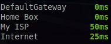

.. _ports:

Ports
=====

*Availability: All*

This plugin aims at providing a list of hosts/port and URL to scan.

You can define ``ICMP`` or ``TCP`` ports scans and URL (head only) check.

The list should be defined in the ``[ports]`` section of the Glances
configuration file.

.. code-block:: ini

    [ports]
    # Ports scanner plugin configuration
    # Interval in second between two scans
    refresh=30
    # Set the default timeout (in second) for a scan (can be overwrite in the scan list)
    timeout=3
    # If port_default_gateway is True, add the default gateway on top of the scan list
    port_default_gateway=True
    #
    # Define the scan list (1 < x < 255)
    # port_x_host (name or IP) is mandatory
    # port_x_port (TCP port number) is optional (if not set, use ICMP)
    # port_x_description is optional (if not set, define to host:port)
    # port_x_timeout is optional and overwrite the default timeout value
    # port_x_rtt_warning is optional and defines the warning threshold in ms
    #
    port_1_host=192.168.0.1
    port_1_port=80
    port_1_description=Home Box
    port_1_timeout=1
    port_2_host=www.free.fr
    port_2_description=My ISP
    port_3_host=www.google.com
    port_3_description=Internet ICMP
    port_3_rtt_warning=1000
    port_4_host=www.google.com
    port_4_description=Internet Web
    port_4_port=80
    port_4_rtt_warning=1000
    #
    # Define Web (URL) monitoring list (1 < x < 255)
    # web_x_url is the URL to monitor (example: http://my.site.com/folder)
    # web_x_description is optional (if not set, define to URL)
    # web_x_timeout is optional and overwrite the default timeout value
    # web_x_rtt_warning is optional and defines the warning respond time in ms (approximately)
    #
    web_1_url=https://blog.nicolargo.com
    web_1_description=My Blog
    web_1_rtt_warning=3000
    web_2_url=https://github.com
    web_3_url=http://www.google.fr
    web_3_description=Google Fr

.. note::

    The ``ports`` plugin colours the status of each entry but **never raises an
    alert**: nothing is written to the event history and no action is
    dispatched. The colour rules differ by entry kind.

    For a host/port entry:

    * *careful* while the scan has not run yet (``Scanning``);
    * *critical* when the scan timed out or the port is closed (``Timeout``);
    * *warning* when the round-trip time exceeds ``port_x_rtt_warning``
      (configured in **milliseconds**).

    For a URL entry:

    * *careful* while the scan has not run yet (``Scanning``);
    * *critical* when the HTTP status code is not 200, 301 or 302, or when the
      request failed (``Error``);
    * *warning* when the response time exceeds ``web_x_rtt_warning``
      (configured in **milliseconds**).

    The whole list is swept by a single background scanner on the global
    ``[ports] refresh`` cadence; ``port_x_refresh`` is not a per-entry timer.

    ``web_x_http_proxy`` / ``web_x_https_proxy`` may embed credentials, so the
    proxy settings and ``web_x_ssl_verify`` are **not** exposed through the
    REST API nor through any export module.

.. warning::

    **Breaking change in Glances v5 — per-port actions are no longer
    dispatched.**

    Glances v4's ``ports`` plugin never writes to the alert history
    (``get_p_alert`` is called with ``log=False``), but it still calls
    ``manage_action()`` unconditionally, so a configured
    ``port_x_critical_action`` / ``web_x_critical_action`` **does** fire in v4
    even though nothing is logged.

    Glances v5 mirrors the "never logged" half of that behaviour by setting
    ``EMITS_ALERTS = False`` on the plugin, but v5's alert pipeline couples
    history ingestion and action dispatch behind that single flag: when
    ``EMITS_ALERTS`` is ``False``, both are skipped. Net effect: v5's
    ``ports`` colours the TUI exactly like v4, but **no per-port or per-URL
    action is ever dispatched**, however it is configured.

    This is a deliberate trade-off, not an oversight: flipping
    ``EMITS_ALERTS`` to ``True`` would restore action dispatch, but would also
    start filling the alert panel and event history with ``ports`` entries
    that v4 never produced.

    **Rewriting the key will not bring the action back.** For completeness,
    v5 also changed the key shape — v4 keyed actions by the item's position
    in the configuration file, whereas v5 keys every action by the field it
    belongs to::

        # v4
        port_1_critical_action=notify-send "host down"
        # v5 key shape (accepted by the parser, still never dispatched
        # for this plugin)
        port_1_status_critical_action=notify-send "host down"

    That second form is documented for forward-compatibility only: it is the
    shape a future release would use if ``ports`` regains action dispatch.
    Today, neither form fires.
