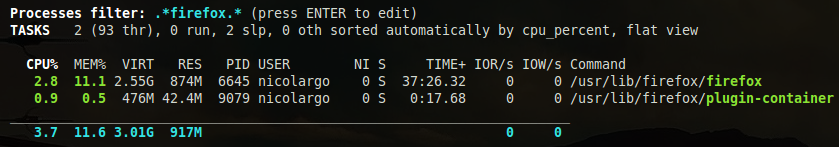
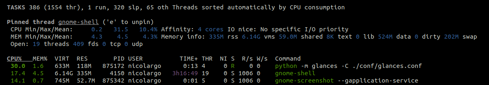
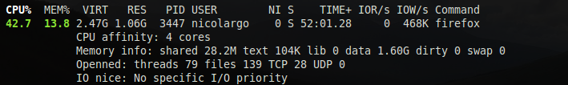

.. _ps:

Processes List
==============

Compact view:

.. image:: ../_static/processlist.png

Full view:

.. image:: ../_static/processlist-wide.png

Filtered view:

Extended view:

The process view consists of 3 parts:

- Processes summary
- Monitored processes list (optional, only in standalone mode)
- Extended stats for the selected process (optional)
- Processes list

The processes summary line displays:

- Total number of tasks/processes (aliases as total in the Glances API)
- Number of threads
- Number of running tasks/processes
- Number of sleeping tasks/processes
- Other number of tasks/processes (not in running or sleeping states)
- Sort key for the process list

By default, or if you hit the ``a`` key, the processes list is
automatically sorted by:

- ``CPU``: if there is no alert (default behavior)
- ``CPU``: if a CPU or LOAD alert is detected
- ``MEM``: if a memory alert is detected
- ``DISK I/O``: if a CPU iowait alert is detected

You can also set the sort key in the UI:

- by clicking on left and right arrows
- by clicking on the following shortcuts or command line option:

.. list-table:: Title
   :widths: 10 30 30
   :header-rows: 1

   * - Shortcut
     - Command line option
     - Description
   * - a
     - Automatic sort
     - Default sort
   * - c
     - --sort-processes cpu_percent
     - Sort by CPU
   * - e
     - N/A
     - Pin the process and display extended stats
   * - i
     - --sort-processes io_counters
     - Sort by DISK I/O
   * - j
     - --programs
     - Accumulate processes by program (extended stats disable in this mode)
   * - m
     - --sort-processes memory_percent
     - Sort by MEM
   * - p
     - --sort-processes name
     - Sort by process name
   * - t
     - --sort-processes cpu_times
     - Sort by CPU times
   * - u
     - --sort-processes username
     - Sort by process username

The number of processes in the list is adapted to the screen size.

Columns display
---------------

.. list-table:: Title
   :widths: 10 60
   :header-rows: 0

   * - ``CPU%``
     - Command line option
     - % of CPU used by the process
       If Irix/Solaris mode is off ('0' key), the value
       is divided by logical core number

========================= ==============================================
``CPU%``                  % of CPU used by the process

                          If Irix/Solaris mode is off ('0' key), the value
                          is divided by logical core number
``MEM%``                  % of MEM used by the process (RES divided by
                          the total RAM you have)
``VIRT``                  Virtual Memory Size

                          The total amount of virtual memory used by the
                          process. It includes all code, data and shared
                          libraries plus pages that have been swapped out
                          and pages that have been mapped but not used.

                          Virtual memory is usually much larger than physical
                          memory, making it possible to run programs for which
                          the total code plus data size is greater than the amount
                          of RAM available.

                          Most of the time, this is not a useful number.
``RES``                   Resident Memory Size

                          The non-swapped physical memory a process is
                          using (what's currently in the physical memory).
``PID``                   Process ID (column is replaced by NPROCS in accumulated mode)
``NPROCS``                Number of process + childs (only in accumulated mode)
``USER``                  User ID
``THR``                   Threads number of the process
``TIME+``                 Cumulative CPU time used by the process
``NI``                    Nice level of the process
``S``                     Process status

                          The status of the process:

                          - ``R``: running or runnable (on run queue)
                          - ``S``: interruptible sleep (waiting for an event)
                          - ``D``: uninterruptible sleep (usually I/O)
                          - ``Z``: defunct ("zombie") process
                          - ``T``: traced by job control signal
                          - ``t``: stopped by debugger during the tracing
                          - ``X``: dead (should never be seen)

``R/s``                   Per process I/O read rate in B/s
``W/s``                   Per process I/O write rate in B/s
``COMMAND``               Process command line or command name

                          User can switch to the process name by
                          pressing on the ``'/'`` key
========================= ==============================================

Process filtering
-----------------

It's possible to filter the processes list using the ``ENTER`` key.

Filter syntax is the following (examples):

- ``python``: Filter processes name or command line starting with
  *python* (regexp)
- ``.*python.*``: Filter processes name or command line containing
  *python* (regexp)
- ``username:nicolargo``: Processes of nicolargo user (key:regexp)
- ``cmdline:\/usr\/bin.*``: Processes starting by */usr/bin*

Extended info
-------------

In standalone mode, additional information are provided for the top
process:

========================= ==============================================
``CPU affinity``          Number of cores used by the process
``Memory info``           Extended memory information about the process

                          For example, on Linux: swap, shared, text,
                          lib, data and dirty
``Open``                  The number of threads, files and network
                          sessions (TCP and UDP) used by the process
``IO nice``               The process I/O niceness (priority)
========================= ==============================================

The extended stats feature can be enabled using the
``--enable-process-extended`` option (command line) or the ``e`` key
(curses interface).

In curses/standalone mode, you can select a process using ``UP`` and ``DOWN`` and press:
- ``k`` to kill the selected process

.. note::
    Limit for CPU and MEM percent values can be overwritten in the
    configuration file under the ``[processlist]`` section. It is also
    possible to define limit for Nice values (comma-separated list).
    For example: nice_warning=-20,-19,-18

Accumulated per program — key 'j'
---------------------------------

When activated ('j' hotkey or --programs option in the command line), processes are merged
to display which programs are active. The columns show the accumulated cpu consumption, the
accumulated virtual and resident memory consumption, the accumulated transferred data I/O.
The PID columns is replaced by a NPROCS column which is the number of processes.

Export process
--------------

Glances version 4 introduces a new feature to export specifics processes. In order to use this
feature, you need to use the export option in the processlist section of the Glances configuration
file or the --export-process-filter option in the command line.

The export option is a list of Glances filters.

Example number one, export all processes named 'python' (or with a command line containing 'python'):

.. code-block:: ini

    [processlist]
    export=.*python.*

Note: or the --export-process-filter ".*python.*" option in the command line.

Example number two, export all processes with the name 'python' or 'bash':

.. code-block:: ini

    [processlist]
    export=.*python.*,.*bash.*

Note: or the --export-process-filter ".*python.*,.*bash.*" option in the command line.

Example number three, export all processes belong to 'nicolargo' user:

.. code-block:: ini

    [processlist]
    export=username:nicolargo

Note: or the --export-process-filter "username:nicolargo" option in the command line.

The output of the export use the PID as the key (for example if you want to export firefox process
to a CSV file):

Configuration file (glances.conf):

.. code-block:: ini

    [processlist]
    export=.*firefox.*

Note: or the --export-process-filter ".*firefox.*" option in the command line.

Command line example:

.. code-block:: bash

    glances -C ./conf/glances.conf --export csv --export-csv-file /tmp/glances.csv --disable-plugin all --enable-plugin processlist --quiet

the result will be:

.. code-block:: csv

    timestamp,845992.memory_percent,845992.status,845992.num_threads,845992.cpu_timesuser,845992.cpu_timessystem,845992.cpu_timeschildren_user,845992.cpu_timeschildren_system,845992.cpu_timesiowait,845992.memory_inforss,845992.memory_infovms,845992.memory_infoshared,845992.memory_infotext,845992.memory_infolib,845992.memory_infodata,845992.memory_infodirty,845992.name,845992.io_counters,845992.nice,845992.cpu_percent,845992.pid,845992.gidsreal,845992.gidseffective,845992.gidssaved,845992.key,845992.time_since_update,845992.cmdline,845992.username,total,running,sleeping,thread,pid_max
    2024-04-03 18:39:55,3.692938041968513,S,138,1702.88,567.89,1752.79,244.18,0.0,288919552,12871561216,95182848,856064,0,984535040,0,firefox,1863281664,0,0.5,845992,1000,1000,1000,pid,2.2084147930145264,/snap/firefox/3836/usr/lib/firefox/firefox,nicolargo,403,1,333,1511,0
    2024-04-03 18:39:57,3.692938041968513,S,138,1702.88,567.89,1752.79,244.18,0.0,288919552,12871561216,95182848,856064,0,984535040,0,firefox,1863281664,0,0.5,845992,1000,1000,1000,pid,2.2084147930145264,/snap/firefox/3836/usr/lib/firefox/firefox,nicolargo,403,1,333,1511,0

