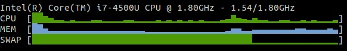

.. _quicklook:

Quick Look
==========

The ``quicklook`` plugin is only displayed on wide screen and proposes a
bar view for cpu, memory, swap and load (this list is configurable).

In the terminal interface, click on ``3`` to enable/disable it.

.. image:: ../_static/quicklook.png

If the per CPU mode is on (by clicking the ``1`` key):

.. image:: ../_static/quicklook-percpu.png

In the Curses/terminal interface, it is also possible to switch from bar to
sparkline using 'S' hot key or --sparkline command line option (need the
sparklines Python lib on your system). Please be aware that sparklines use
the Glances history and will not be available if the history is disabled
from the command line. For the moment sparkline is not available in
client/server mode (see issue ).

.. note::
    Limit values can be overwritten in the configuration file under
    the ``[quicklook]`` section.

You can also configure the stats list and the bat character used in the
user interface.

.. code-block:: ini

    [quicklook]
    # Stats list (default is cpu,mem,load)
    # Available stats are: cpu,mem,load,swap
    list=cpu,mem,load
    # Graphical percentage char used in the terminal user interface (default is |)
    bar_char=|
