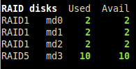

.. _raid:

RAID
====

*Availability: Linux*

*Dependency: this plugin uses the optional pymdstat Python lib*

This plugin is disable by default, please use the --enable-plugin raid option
to enable it or enable it in the glances.conf file:

.. code-block:: ini

    [raid]
    # Documentation: https://glances.readthedocs.io/en/latest/aoa/raid.html
    # This plugin is disabled by default
    disable=False

In the terminal interface, click on ``R`` to enable/disable it.

Alerts
------

Since Glances 5, a **degraded** RAID array (fewer active than available
disks → ``warning``) and an **inactive** array (→ ``critical``) raise a
Glances alert. They appear in the alert view and trigger any configured
action, in addition to being coloured in the terminal interface. In
Glances 4 these conditions were coloured only, with no alert raised.

This plugin is only available on GNU/Linux.
