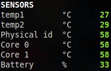

.. _sensors:

Sensors
=======

*Availability: Linux*

Glances can display the sensors information using ``psutil``,
``hddtemp`` and ``batinfo``:
- motherboard and CPU temperatures
- hard disk temperature
- battery capacity

Limit values and sensors alias names can be defined in the configuration
file under the ``[sensors]`` section.

Limit can be defined for a specific sensor, a type of sensor or defineby the system
thresholds (default behavor).

.. code-block:: ini

    [sensors]
    # Sensors core thresholds (in Celsius...)
    # By default values are grabbed from the system
    # Overwrite thresholds for a specific sensor
    temperature_core_Ambient_careful=45
    temperature_core_Ambient_warning=65
    temperature_core_Ambient_critical=80
    temperature_core_Ambient_log=False
    # Overwrite thresholds for a specific type of sensor
    #temperature_core_careful=45
    #temperature_core_warning=65
    #temperature_core_critical=80

.. note 1::
    The support for multiple batteries is only available if
    you have the batinfo Python lib installed on your system
    because for the moment PSUtil only support one battery.

.. note 2::
    If a sensors has temperature and fan speed with the same name unit,
    it is possible to alias it using:
    alias=unitname_temperature_core_alias:Alias for temp,unitname_fan_speed_alias:Alias for fan speed

.. note 3::
    If a sensors has multiple identical features names (see #2280), then
    Glances will add a suffix to the feature name.
    For example, if you have one sensor with two Composite features, the
    second one will be named Composite_1.

.. note 4::
    The plugin could crash on some operating system (FreeBSD) with the
    TCP or UDP blackhole option > 0 (see issue #2106). In this case, you
    should disable the sensors (--disable-plugin sensors or from the
    configuration file).