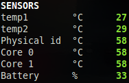

.. _sensors:

Sensors
=======

*Availability: Linux*

Glances can display the sensors information using ``psutil``,
``hddtemp`` and ``batinfo``:
- motherboard and CPU temperatures
- hard disk temperature
- battery capacity

Limit values and sensors alias names can be defined in the configuration
file under the ``[sensors]`` section.

Limit can be defined for a specific sensor, a type of sensor or defineby the system
thresholds (default behavor).

.. code-block:: ini

    [sensors]
    # Sensors core thresholds (in Celsius...)
    # Note: By default values are grabbed from the system (if values are available)
    # Core temperature thresholds in °C
    # Default values if not defined: 45/52/60
    temperature_core_careful=45
    temperature_core_warning=65
    temperature_core_critical=80
    # Temperatures threshold in °C for hddtemp
    # Default values if not defined: 45/52/60
    #temperature_hdd_careful=45
    #temperature_hdd_warning=52
    #temperature_hdd_critical=60
    # Battery threshold in %
    # Default values if not defined: 70/80/90
    #battery_careful=70
    #battery_warning=80
    #battery_critical=90
    # Fan speed threshold in RPM
    #fan_speed_careful=100
    # Overwrite thresholds for a specific sensor
    #temperature_core_Ambient_careful=40
    #temperature_core_Ambient_warning=60
    #temperature_core_Ambient_critical=85
    #temperature_core_Ambient_log=True
    #temperature_core_Ambient_critical_action=echo "{{time}} {{label}} temperature {{value}}{{unit}} higher than {{critical}}{{unit}}" > /tmp/temperature.alert
    # Display sensors in mean (fold same-prefix sensors into "<prefix> (mean)")
    #mean=true
    #temperature_core_mean=true
    #fan_speed_mean=true
    #temperature_hdd_mean=true
    #battery_mean=true
    # Sensors alias
    #alias=core 0:CPU Core 0,core 1:CPU Core 1

Displaying sensors in mean
--------------------------

When a sensor type exposes several similarly named entries (``Core 0``,
``Core 1``, ...), Glances can fold them into a single averaged line named
``<prefix> (mean)``. Folding only applies to a group of **more than one**
sensor sharing the same prefix; a lone sensor is left untouched.

Two levels of configuration are available under the ``[sensors]`` section:

- ``mean=true`` — global toggle. Every sensor type with more than one line
  is displayed in mean.
- ``<type>_mean=true|false`` — per-type override (``temperature_core_mean``,
  ``fan_speed_mean``, ``temperature_hdd_mean``, ``battery_mean``). When set,
  it always wins over the global ``mean`` value.

Both default to ``false``. The per-type key can opt a type *out* while the
global toggle is on, or *in* while it is off. For example, to display every
type in mean except the battery:

.. code-block:: ini

    [sensors]
    mean=true
    battery_mean=false

.. note 1::
    The support for multiple batteries is only available if
    you have the batinfo Python lib installed on your system
    because for the moment PSUtil only support one battery.

.. note 2::
    If a sensors has temperature and fan speed with the same name unit,
    it is possible to alias it using:
    alias=unitname_temperature_core_alias:Alias for temp,unitname_fan_speed_alias:Alias for fan speed

.. note 3::
    If a sensors has multiple identical features names (see #2280), then
    Glances will add a suffix to the feature name.
    For example, if you have one sensor with two Composite features, the
    second one will be named Composite_1.

.. note 4::
    The plugin could crash on some operating system (FreeBSD) with the
    TCP or UDP blackhole option > 0 (see issue #2106). In this case, you
    should disable the sensors (--disable-plugin sensors or from the
    configuration file).