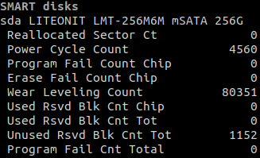

.. _smart:

SMART
=====

*Availability: all but Mac OS*

*Dependency: this plugin uses the optional pySMART Python lib*

This plugin is disable by default, please use the --enable-plugin smart option
to enable it.

Glances displays all the SMART attributes.

How to read the information:

- The first line display the name and model of the device
- The first column is the SMART attribute name
- The second column is the SMART attribute raw value

.. warning::
    This plugin needs administrator rights. Please run Glances as root/admin.

Also, you can hide sensors using regular expressions.

To hide sensors you should use the hide option:

.. code-block:: ini

    [smart]
    hide=.*Hide_this_driver.*

It is also possible to configure a white list of devices to display.
Example to only show .*Drive_Temperature.* sensors:

.. code-block:: ini

     [smart]
     show=.*Drive_Temperature.*

Filtering is based on regular expression. Please be sure that your regular
expression works as expected. You can use an online tool like `regex101`_ in
order to test your regular expression.

.. _regex101: https://regex101.com/