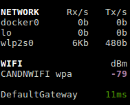

.. _wifi:

Wi-Fi
=====

*Availability: Linux (with an /proc/net/wireless file) only*

In the configuration file, you can define signal quality thresholds:

- ``"Poor"`` quality is between -100 and -85dBm
- ``"Good"`` quality between -85 and -60dBm
- ``"Excellent"`` between -60 and -40dBm

Thresholds for the signal quality can be defined in the configuration file:

.. code-block:: ini

    [wifi]
    disable=False
    careful=-65
    warning=-75
    critical=-85

You can disable this plugin using the ``--disable-plugin wifi`` option or by
hitting the ``W`` key from the user interface.
