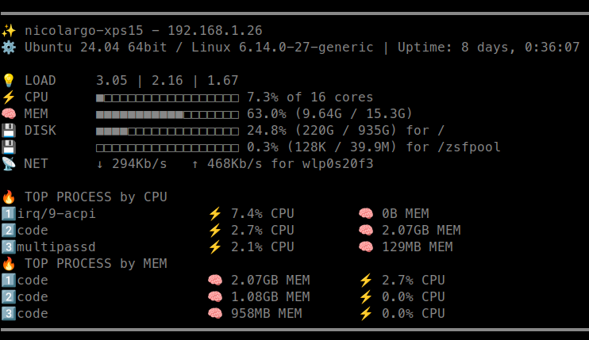

.. _fetch:

Fetch
=====

The fetch mode is used to get and share a quick look of a machine using the
``fetch`` option. In this mode, current stats are displayed on the console in
a fancy way.

.. code-block:: console

    $ glances --fetch

Results look like this:

It is also possible to use a custom template with the ``--fetch-template </path/to/template.jinja>`` option.

The format of the template is based on the Jinja2 templating engine and can use all the stats
available in Glances through the ``gl`` variable (an instance of the :ref:`Glances Python API<api>`).

For example, the default template is define as:

.. code-block:: jinja

    ━━━━━━━━━━━━━━━━━━━━━━━━━━━━━━━━━━━━━━━━━━━━━━━━━━━━━━━━━━━━━━━━━━━━━━━━━━━━━━━
    ✨ {{ gl.system['hostname'] }}{{ ' - ' + gl.ip['address'] if gl.ip['address'] else '' }}
    ⚙️  {{ gl.system['hr_name'] }} | Uptime: {{ gl.uptime }}

    💡 LOAD     {{ '%0.2f'| format(gl.load['min1']) }} |\
    {{ '%0.2f'| format(gl.load['min5']) }} |\
    {{ '%0.2f'| format(gl.load['min15']) }}
    ⚡ CPU      {{ gl.bar(gl.cpu['total']) }} {{ gl.cpu['total'] }}% of {{ gl.core['log'] }} cores
    🧠 MEM      {{ gl.bar(gl.mem['percent']) }} {{ gl.mem['percent'] }}% ({{ gl.auto_unit(gl.mem['used']) }} /\
    {{ gl.auto_unit(gl.mem['total']) }})
    \
    💾 DISK         {{ gl.bar(gl.fs[fs]['percent']) }} {{ gl.fs[fs]['percent'] }}% ({{ gl.auto_unit(gl.fs[fs]['used']) }} /\
    {{ gl.auto_unit(gl.fs[fs]['size']) }}) for {{ fs }}
    \
    \
    📡 NET         ↓ {{ gl.auto_unit(gl.network[net]['bytes_recv_rate_per_sec']) }}b/s  \
    ↑ {{ gl.auto_unit(gl.network[net]['bytes_sent_rate_per_sec']) }}b/s for {{ net }}
    \

    🔥 TOP PROCESS by CPU
    \
    {{ loop.index }}️⃣ {{ process['name'][:20] }}{{ ' ' * (20 - process['name'][:20] | length) }}\
        ⚡ {{ process['cpu_percent'] }}% CPU\
    {{ ' ' * (8 - (gl.auto_unit(process['cpu_percent']) | length)) }}\
        🧠 {{ gl.auto_unit(process['memory_info']['rss']) }}B MEM
    \
    🔥 TOP PROCESS by MEM
    \
    {{ loop.index }}️⃣ {{ process['name'][:20] }}{{ ' ' * (20 - process['name'][:20] | length) }}\
        🧠 {{ gl.auto_unit(process['memory_info']['rss']) }}B MEM\
    {{ ' ' * (7 - (gl.auto_unit(process['memory_info']['rss']) | length)) }}\
        ⚡ {{ process['cpu_percent'] }}% CPU
    \
    ━━━━━━━━━━━━━━━━━━━━━━━━━━━━━━━━━━━━━━━━━━━━━━━━━━━━━━━━━━━━━━━━━━━━━━━━━━━━━━━
