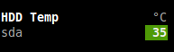

=======
Glances
=======

This manual describes *Glances* version 2.0.

Copyright © 2012-2014 Nicolas Hennion <nicolas@nicolargo.com>

May 2014

.. contents:: Table of Contents

Introduction
============

Glances is a cross-platform curses-based monitoring tool which aims to
present a maximum of information in a minimum of space, ideally to fit
in a classical 80x24 terminal or higher to have additional information.
Glances can adapt dynamically the displayed information depending on the
terminal size. 

Glances can also work in a client/server mode. Remote monitoring could be 
done via terminal or Web interface.

Glances is written in Python and uses the `psutil`_ library to get information from your system.

Console (80x24)

.. image:: images/screenshot.png

Full view (>80x24)

.. image:: images/screenshot-wide.png

Web interface (Firefox)

.. image:: images/screenshot-web.png

Usage
=====

Standalone mode
---------------

Simply run:

.. code-block:: console

    $ glances

Client/Server mode
------------------

If you want to remotely monitor a machine, called ``server``, from another one, called ``client``, just run on the server:

.. code-block:: console

    server$ glances -s

and on the client:

.. code-block:: console

    client$ glances -c @server

where ``@server`` is the IP address or hostname of the server.

In server mode, you can set the bind address ``-B ADDRESS`` and listening TCP port ``-p PORT``.

In client mode, you can set the TCP port of the server ``-p PORT``.

You can also set a password to access to the server ``--password``.

Default binding address is ``0.0.0.0`` (Glances will listen on all the network interfaces) and TCP port is ``61209``.

In client/server mode, limits are set by the server side.

Glances is ``IPv6`` compatible. Just use the ``-B ::`` option to bind to all IPv6 addresses.

As an experimental feature, if Glances server is not detected by the client, this last one try to grab stats using the SNMP protocol:

.. code-block:: console

    client$ glances -c @snmpserver 

Known limitation: Grab using SNMP is only validated for GNU/Linux operating system with SNMP v2/2c server.

Web Server mode
----------------

If you want to remotely monitor a machine, called ``server``, from any device with a Web Browser (called ``client``), just run on the server:

.. code-block:: console

    server$ glances -w

and on the client, enter the following URL in your favorite Web Browser:

    http:\\@server:61208\

where ``@server`` is the IP address or hostname of the server.

The Glances Web interface is responsive web designed (Android device screenshot):

.. image:: images/screenshot-web2.png

Command reference
=================

Command-line options
--------------------

-h, --help            show this help message and exit
-V, --version             show program's version number and exit
-b, --byte            display network rate in byte per second
-B BIND_ADDRESS, --bind BIND_ADDRESS
                    bind server to the given IPv4/IPv6 address or hostname
-c CLIENT, --client CLIENT
                    connect to a Glances server by IPv4/IPv6 address or
                    hostname
-C CONF_FILE, --config CONF_FILE
                    path to the configuration file
--disable-bold        disable bold mode in the terminal
--disable-diskio      disable disk I/O module
--disable-fs          disable filesystem module
--disable-network     disable network module
--disable-sensors     disable sensors module
--disable-process     disable process module
--disable-log         disable log module
--output-csv OUTPUT_CSV
                    export stats to a csv file
-p PORT, --port PORT  define the client/server TCP port [default: 61209]
--password            define a client/server password from the prompt/file
-s, --server          run Glances in server mode
--snmp-community SNMP_COMMUNITY
                    SNMP community
--snmp-port SNMP_PORT
                    SNMP port
--snmp-version SNMP_VERSION
                    SNMP version (1, 2c or 3)
--snmp-user SNMP_USER
                    SNMP username (only for SNMPv3)
--snmp-auth SNMP_AUTH
                    SNMP authentication key (only for SNMPv3)
-t TIME, --time TIME  set refresh time in seconds [default: 3 sec]
-w, --webserver       run Glances in web server mode
-1, --percpu          start Glances in per CPU mode

Interactive commands
--------------------

The following commands (key pressed) are supported while in Glances:

``a``
    Sort process list automatically

    - If CPU iowait ``>60%``, sort processes by I/O read and write
    - If CPU ``>70%``, sort processes by CPU usage
    - If MEM ``>70%``, sort processes by memory usage
``b``
    Switch between bit/s or Byte/s for network I/O
``c``
    Sort processes by CPU usage
``d``
    Show/hide disk I/O stats
``f``
    Show/hide file system stats
``h``
    Show/hide the help screen
``i``
    Sort processes by I/O rate (may need root privileges on some OSes)
``l``
    Show/hide log messages
``m``
    Sort processes by MEM usage
``n``
    Show/hide network stats
``p``
    Sort processes by name
``q``
    Quit
``s``
    Show/hide sensors stats
``t``
    View network I/O as combination
``u``
    View cumulative network I/O
``w``
    Delete finished warning log messages
``x``
    Delete finished warning and critical log messages
``y``
    Show/hide hddtemp stats
``1``
    Switch between global CPU and per-CPU stats

Configuration
=============

**Caution: be aware that the Glances version 1.x configurations files are not comaptible with the version 2.x.**

No configuration file is mandatory to use Glances.

Furthermore a configuration file is needed for setup limits, disks or network interfaces to hide and/or monitored processes list.

By default, the configuration file is under:

:Linux: ``/etc/glances/glances.conf``
:\*BSD and OS X: ``/usr/local/etc/glances/glances.conf``
:Windows: ``%APPDATA%\glances\glances.conf``

On Windows XP, the ``%APPDATA%`` path is:

.. code-block:: console

    C:\Documents and Settings\<User>\Application Data

Since Windows Vista and newer versions:

.. code-block:: console

    C:\Users\<User>\AppData\Roaming

You can override the default configuration, located in one of the above
directories on your system, except for Windows.

Just copy the ``glances.conf`` file to your ``$XDG_CONFIG_HOME`` directory, e.g. Linux:

.. code-block:: console

    mkdir -p $XDG_CONFIG_HOME/glances
    cp /etc/glances/glances.conf $XDG_CONFIG_HOME/glances/

On OS X, you should copy the configuration file to ``~/Library/Application Support/glances/``.

Anatomy of the application
==========================

Legend
------

| ``GREEN`` stat counter is ``"OK"``
| ``BLUE`` stat counter is ``"CAREFUL"``
| ``MAGENTA`` stat counter is ``"WARNING"``
| ``RED`` stat counter is ``"CRITICAL"``

Note: Only stats with colored background will be logged in the alert view.

Header
------

.. image:: images/header.png

The header shows the hostname, OS name, release version, platform architecture and system uptime (on the upper right).
Additionnaly, on GNU/Linux operating system, it shows also the kernel version.

In client mode, the server connection status is displayed:

Connected:

.. image:: images/connected.png

Disconnected:

.. image:: images/disconnected.png

CPU
---

Short view:

.. image:: images/cpu.png

If enough horizontal space is available, extended CPU informations are displayed.

Extended view:

.. image:: images/cpu-wide.png

To switch to per-CPU stats, just hit the ``1`` key:

.. image:: images/per-cpu.png

The CPU stats are shown as a percentage and for the configured refresh time.
The total CPU usage is displayed on the first line.

| If user|system|iowait CPU is ``<50%``, then status is set to ``"OK"``
| If user|system|iowait CPU is ``>50%``, then status is set to ``"CAREFUL"``
| If user|system|iowait CPU is ``>70%``, then status is set to ``"WARNING"``
| If user|system|iowait CPU is ``>90%``, then status is set to ``"CRITICAL"``

*Note*: limit values can be overwritten in the configuration file under the ``[cpu]`` or/and ``[percpu]`` sections.

Load
----

.. image:: images/load.png

On the *No Sheep* blog, *Zachary Tirrell* defines the average load [1]_:

    "In short it is the average sum of the number of processes
    waiting in the run-queue plus the number currently executing
    over 1, 5, and 15 minutes time periods."

Glances gets the number of CPU core to adapt the alerts.
Alerts on average load are only set on 15 minutes time period.
The first line also display the number of CPU core.

| If average load is ``<0.7*core``, then status is set to ``"OK"``
| If average load is ``>0.7*core``, then status is set to ``"CAREFUL"``
| If average load is ``>1*core``, then status is set to ``"WARNING"``
| If average load is ``>5*core``, then status is set to ``"CRITICAL"``

*Note*: limit values can be overwritten in the configuration file under the ``[load]`` section.

Memory
------

Glances uses two columns: one for the ``RAM`` and another one for the ``SWAP``.

.. image:: images/mem.png

If enough space is available, Glances displays extended informations for the ``RAM``:

.. image:: images/mem-wide.png

With Glances, alerts are only set for used memory and swap.

| If memory is ``<50%``, then status is set to ``"OK"``
| If memory is ``>50%``, then status is set to ``"CAREFUL"``
| If memory is ``>70%``, then status is set to ``"WARNING"``
| If memory is ``>90%``, then status is set to ``"CRITICAL"``

*Note*: limit values can be overwritten in the configuration file under the ``[memory]`` and ``[memswap]`` sections.

Network
-------

.. image:: images/network.png

Glances displays the network interface bit rate. The unit is adapted
dynamically (bits per second, kbits per second, Mbits per second, etc).

Alerts are only set if the network interface maximum speed is available (see sample in the configuration file).

*Note*: In the `[network]`` section of the configuration file, you can define a list of network interfaces to hide and per interface limits value.

Disk I/O
--------

.. image:: images/diskio.png

Glances displays the disk I/O throughput. The unit is adapted dynamically.

*Note*: There is no alert on this information.

*Note*: In the configuration file, you can define a list of disk to hide.

File system
-----------

.. image:: images/fs.png

Glances displays the used and total file system disk space. The unit is
adapted dynamically.

Alerts are set for used disk space:

| If disk used is ``<50%``, then status is set to ``"OK"``
| If disk used is ``>50%``, then status is set to ``"CAREFUL"``
| If disk used is ``>70%``, then status is set to ``"WARNING"``
| If disk used is ``>90%``, then status is set to ``"CRITICAL"``

*Note*: limit values can be overwritten in the configuration file under ``[filesystem]`` section.

Sensors
-------

Glances can displays the sensors information trough `lm-sensors` (only available on GNU/Linux), HDDTemp and BatInfo.

As of lm-sensors, a filter is processed in order to display temperature only:

.. image:: images/sensors.png

Glances can also grab hard disk temperature through the `hddtemp` daemon (see here [2]_ to install hddtemp on your system):

There is no alert on this information.

*Note*: limit values can be overwritten in the configuration file under the ``[sensors]`` section.

Processes list
--------------

Compact view:

.. image:: images/processlist.png

Full view:

.. image:: images/processlist-wide.png

Three views are available for processes:

* Processes summary
* Optional monitored processes list (see bellow)
* Processes list

The processes summary line display:

* Tasks number (total number of processes)
* Threads number 
* Running tasks number
* Sleeping tasks number
* Other tasks number (not running or sleeping)
* Sort key

By default, or if you hit the ``a`` key, the processes list is automatically
sorted by:

* CPU if there is no alert (default behavor)
* CPU if a CPU or LOAD alert is detected
* MEM if a memory alert is detected
* DiskIO if a CPU IOWait alert is detected

The number of processes in the list is adapted to the screen size.

``CPU%``
    % of CPU used by the process
``MEM%``
    % of MEM used by the process
``VIRT``
    Total program size (VMS)
``RES``
    Resident set size (RSS)
``PID``
    Process ID
``USER``
    User ID
``NI``
    Nice level of the process
``S``
    Process status (see details bellow) (running process is highlighted)
``TIME+``
    Cumulative CPU time used
``IOR/s``
    Per process IO read rate (in Byte/s)
``IOW/s``
    Per process IO write rate (in Byte/s)
``COMMAND``
    Process command line (process name is highlighted)

Process Status legend:

``R``
    Running
``S``
    Sleeping (may be interrupted)
``D``
    Disk sleep (may not be interrupted)
``T``
    Traced / Stopped
``Z``
    Zombie

*Note*: limits values can be overwritten in the configuration file under the ``[process]`` section.

Monitored processes list
------------------------

The monitored processes list allows user, through the configuration file,
to group processes and quickly show if the number of running process is not good.

.. image:: images/monitored.png

Each item is defined by:

* ``description``: description of the processes (max 16 chars).
* ``regex``: regular expression of the processes to monitor.
* ``command`` (optional): full path to shell command/script for extended stat. Should return a single line string. Use with caution.
* ``countmin`` (optional): minimal number of processes. A warning will be displayed if number of processes < count.
* ``countmax`` (optional): maximum number of processes. A warning will be displayed if number of processes > count.

Up to 10 items can be defined.

For example, if you want to monitor the Nginx processes on a Web server, the following definition should do the job:

.. code-block:: console

    [monitor]
    list_1_description=Nginx server
    list_1_regex=.*nginx.*
    list_1_command=nginx -v
    list_1_countmin=1
    list_1_countmax=4

If you also want to monitor the PHP-FPM daemon processes, you should add another item:

.. code-block:: console

    [monitor]
    list_1_description=Nginx server
    list_1_regex=.*nginx.*
    list_1_command=nginx -v
    list_1_countmin=1
    list_1_countmax=4
    list_1_description=PHP-FPM
    list_1_regex=.*php-fpm.*
    list_1_countmin=1
    list_1_countmax=20

In client/server mode, the list is defined on the server side.
A new method, called getAllMonitored, is available in the APIs and get the JSON representation of the monitored processes list.

Alerts are set as following:

| If number of processes is 0, then status is set to ``"CRITICAL"``
| If number of processes is min < current < max, then status is set to ``"OK"``
| Else status is set to ``"WARNING"``

Logs
----

.. image:: images/logs.png

A log messages list is displayed in the bottom of the screen if (and only if):

- at least one ``WARNING`` or ``CRITICAL`` alert was occurred
- space is available in the bottom of the console/terminal

Each alert message displays the following information:

1. start date
2. duration if alert is terminated or ongoing if the alert is on going
3. alert name
4. {min/avg/max} values or number of running processes for monitored processes list alerts

API documentation
=================

Glances uses a `XML-RPC server`_ and can be used by another client software.

API documentation is available at https://github.com/nicolargo/glances/wiki/The-Glances-2.x-API-How-to

Others outputs
==============

It is possible to export statistics to CSV file.

.. code-block:: console

    $ glances --output-csv /tmp/glances.csv

CSV files have two lines per stats:

- Stats description
- Stats (comma separated)

Support
=======

To report a bug or a feature request use the bug tracking system at https://github.com/nicolargo/glances/issues

Feel free to contribute!

.. [1] http://nosheep.net/story/defining-unix-load-average/
.. [2] http://www.cyberciti.biz/tips/howto-monitor-hard-drive-temperature.html
.. [3] https://github.com/nicolargo/batinfo

.. _psutil: https://code.google.com/p/psutil/
.. _XML-RPC server: http://docs.python.org/2/library/simplexmlrpcserver.html
