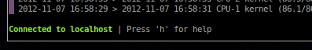

=======
Glances
=======

This manual describes *Glances* version 1.7.

Copyright © 2012-2013 Nicolas Hennion <nicolas@nicolargo.com>

April 2013

.. contents:: Table of Contents

Introduction
============

Glances is a cross-platform curses-based monitoring tool which aims to
present a maximum of information in a minimum of space, ideally to fit
in a classical 80x24 terminal or higher to have additional information.

Glances can adapt dynamically the displayed information depending on the
terminal size. It can also work in a client/server mode for remote monitoring.

Glances is written in Python and uses the `psutil`_ library to get information from your system.

Console (80x24)

.. image:: images/screenshot.png

Full view (>80x24)

.. image:: images/screenshot-wide.png

Usage
=====

Standalone mode
---------------

Simply run:

.. code-block:: console

    $ glances

Client/Server mode
------------------

If you want to remotely monitor a machine, called ``server``, from another one, called ``client``,
just run on the server:

.. code-block:: console

    server$ glances -s

and on the client:

.. code-block:: console

    client$ glances -c @server

where ``@server`` is the IP address or host name of the server.

In server mode, you can set the bind address ``-B ADDRESS`` and listening TCP port ``-p PORT``.

In client mode, you can set the TCP port of the server ``-p PORT``.

Default binding address is ``0.0.0.0`` (Glances will listen on all the network interfaces) and TCP port is ``61209``.

In client/server mode, limits are set by the server side.

The version 1.6 introduces a optional password to access to the server ``-P password``.

Command reference
=================

Command-line options
--------------------

-b           Display network rate in Byte per second
-B IP        Bind server to the given IP or hostname
-c IP        Connect to a Glances server
-C file      Path to the configuration file (default: {/usr/local,}/etc/glances/glances.conf)
-d           Disable disk I/O module
-e           Enable the sensors module (Linux-only)
-f file      Set the output folder (HTML) or file (CSV)
-h           Display the help and exit
-m           Disable mount module
-n           Disable network module
-o output    Define additional output (available: HTML or CSV)
-p PORT      Define the client or server TCP port (default: 61209)
-P password  Define a client/server password
-r           Do not list processes
-s           Run Glances in server mode
-t sec       Set the refresh time in seconds (default: 3)
-v           Display the version and exit
-y           Enable the hddtemp module (needs running hddtemp daemon)
-z           Do not use the bold color attribute

Interactive commands
--------------------

The following commands are supported while in Glances:

``a``
    Automatic mode. The processes are sorted automatically.

    - If CPU iowait ``>60%``, sort processes by IO read and write
    - If CPU ``>70%``, sort processes by CPU usage
    - If MEM ``>70%``, sort processes by memory usage
``b``
    Switch between bit/s or Byte/s for network IO
``c``
    Sort processes by CPU%
``d``
    Show/hide disk I/O stats
``f``
    Show/hide file system stats
``h``
    Show/hide the help message (with the keys you can press and the limits)
``i``
    Sort processes by IO rate (need root account on some OS)
``l``
    Show/hide log messages
``m``
    Sort processes by MEM%
``n``
    Show/hide network stats
``p``
    Sort processes by name
``s``
    Show/hide sensors stats (only available with -e flag; pysensors library is needed; Linux-only)
``t``
    View network IO as combination
``u``
    View cumulative network IO
``w``
    Delete finished warning log messages
``x``
    Delete finished warning and critical log messages
``1``
    Switch between global CPU and per-CPU stats
``q``
    Quit

Configuration
=============

No configuration is needed to use Glances.

Furthermore, starting from release 1.6, it has been introduced a configuration file for setup limits.

By default, the configuration file is under:

.. code-block:: console

    /etc/glances/glances.conf (Linux)

or:

.. code-block:: console

    /usr/local/etc/glances/glances.conf (*BSD and OS X)

To override the default configuration, you can copy the ``glances.conf`` file to
your ``$XDG_CONFIG_HOME`` directory (e.g. Linux):

.. code-block:: console

    mkdir -p $XDG_CONFIG_HOME/glances
    cp /etc/glances/glances.conf $XDG_CONFIG_HOME/glances/

On OS X, you should copy the configuration file to ``~/Library/Application Support/glances/``.

Anatomy of the application
==========================

Legend
------

| ``GREEN`` stat counter is ``"OK"``
| ``BLUE`` stat counter is ``"CAREFUL"``
| ``MAGENTA`` stat counter is ``"WARNING"``
| ``RED`` stat counter is ``"CRITICAL"``

Header
------

.. image:: images/header.png

The header shows the OS name, release version, platform architecture and the host name.
On Linux, it shows also the kernel version.

CPU
---

Short view:

.. image:: images/cpu.png

If enough horizontal space is available, extended CPU informations are displayed.

Extended view:

.. image:: images/cpu-wide.png

To switch to per-CPU stats, just hit the ``1`` key:

.. image:: images/per-cpu.png

The CPU stats are shown as a percentage and for the configured refresh time.
The total CPU usage is displayed on the first line.

| If user|system|nice CPU is ``<50%``, then status is set to ``"OK"``
| If user|system|nice CPU is ``>50%``, then status is set to ``"CAREFUL"``
| If user|system|nice CPU is ``>70%``, then status is set to ``"WARNING"``
| If user|system|nice CPU is ``>90%``, then status is set to ``"CRITICAL"``

Load
----

.. image:: images/load.png

On the *No Sheep* blog, *Zachary Tirrell* defines the average load [1]_:

    "In short it is the average sum of the number of processes
    waiting in the run-queue plus the number currently executing
    over 1, 5, and 15 minute time periods."

Glances gets the number of CPU core to adapt the alerts.
Alerts on average load are only set on 5 and 15 min.
The first line also display the number of CPU core.

| If average load is ``<0.7*core``, then status is set to ``"OK"``
| If average load is ``>0.7*core``, then status is set to ``"CAREFUL"``
| If average load is ``>1*core``, then status is set to ``"WARNING"``
| If average load is ``>5*core``, then status is set to ``"CRITICAL"``

Memory
------

Glances uses two columns: one for the ``RAM`` and another one for the ``Swap``.

.. image:: images/mem.png

If enough space is available, Glances displays extended informations:

.. image:: images/mem-wide.png

With Glances, alerts are only set for on used memory and used swap.

| If memory is ``<50%``, then status is set to ``"OK"``
| If memory is ``>50%``, then status is set to ``"CAREFUL"``
| If memory is ``>70%``, then status is set to ``"WARNING"``
| If memory is ``>90%``, then status is set to ``"CRITICAL"``

Network
-------

.. image:: images/network.png

Glances displays the network interface bit rate. The unit is adapted
dynamically (bits per second, kbits per second, Mbits per second, etc).

Alerts are only set if the network interface maximum speed is available.

For example, on a 100 Mbps ethernet interface, the warning status is set
if the bit rate is higher than 70 Mbps.

| If bit rate is ``<50%``, then status is set to ``"OK"``
| If bit rate is ``>50%``, then status is set to ``"CAREFUL"``
| If bit rate is ``>70%``, then status is set to ``"WARNING"``
| If bit rate is ``>90%``, then status is set to ``"CRITICAL"``

Sensors
-------

.. image:: images/sensors.png

Glances can displays the sensors informations trough `lm-sensors` (only
available on Linux).

A filter is processed in order to only display temperature.

You should enable this module using the following command line:

.. code-block:: console

    $ glances -e

There is no alert on this information.

Disk I/O
--------

.. image:: images/diskio.png

Glances displays the disk I/O throughput. The unit is adapted dynamically.

There is no alert on this information.

File system
-----------

.. image:: images/fs.png

Glances displays the used and total file system disk space. The unit is
adapted dynamically.

Alerts are set for used disk space:

| If disk used is ``<50%``, then status is set to ``"OK"``
| If disk used is ``>50%``, then status is set to ``"CAREFUL"``
| If disk used is ``>70%``, then status is set to ``"WARNING"``
| If disk used is ``>90%``, then status is set to ``"CRITICAL"``

Processes list
--------------

Compact view:

.. image:: images/processlist.png

Full view:

.. image:: images/processlist-wide.png

Glances displays a summary and a list of processes.

By default, or if you hit the ``a`` key, the processes list is automatically
sorted by CPU of memory usage.

The number of processes in the list is adapted to the screen size.

``VIRT``
    Virtual memory size
``RES``
    Resident memory
``CPU%``
    % of CPU used by the process
``MEM%``
    % of MEM used by the process
``PID``
    Process ID
``USER``
    User ID per process
``NI``
    Nice level of the process
``S``
    Process status
``TIME+``
    Cumulative CPU time used
``IOR/s``
    Per process IO read rate (in Byte/s)
``IOW/s``
    Per process IO write rate (in Byte/s)
``NAME``
    Process name or command line

Process status legend:

``R``
    running
``S``
    sleeping (may be interrupted)
``D``
    disk sleep (may not be interrupted)
``T``
    traced/stopped
``Z``
    zombie

Logs
----

.. image:: images/logs.png

A log messages list is displayed in the bottom of the screen if (and only if):

- at least one ``WARNING`` or ``CRITICAL`` alert was occurred
- space is available in the bottom of the console/terminal

Each alert message displays the following information:

1. start date
2. end date
3. alert name
4. {min/avg/max} values

Footer
------

.. image:: images/footer.png

Glances displays the current date & time and access to the embedded help screen.

If you have ran Glances in client mode ``-c``, you can also see if the client is connected to the server.

If client is connected:

else:

.. image:: images/client-disconnected.png

On the left, you can easily see if you are connected to a Glances server.

API documentation
=================

Glances uses a `XML-RPC server`_ and can be used by another client software.

API documentation is available at https://github.com/nicolargo/glances/wiki/The-Glances-API-How-To

Support
=======

To report a bug or a feature request use the bug tracking system at https://github.com/nicolargo/glances/issues

Feel free to contribute!

.. [1] http://nosheep.net/story/defining-unix-load-average/

.. _psutil: https://code.google.com/p/psutil/
.. _XML-RPC server: http://docs.python.org/2/library/simplexmlrpcserver.html
