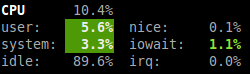
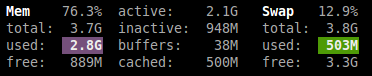
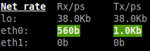
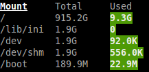
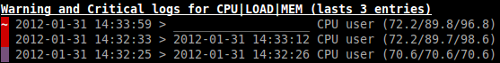

=======
Glances
=======

This manual describes *Glances* version 2.2.1.

Copyright © 2012-2014 Nicolas Hennion <nicolas@nicolargo.com>

December 2014

.. contents:: Table of Contents

Introduction
============

Glances is a cross-platform curses-based system monitoring tool which
aims to present a maximum of information in a minimum of space, ideally
to fit in a classical 80x24 terminal or higher to have additional
information. It can adapt dynamically the displayed information depending
on the terminal size.

Glances can also work in client/server mode. Remote monitoring could be
done via terminal or web interface.

Glances is written in Python and uses the `psutil`_ library to get
information from your system.

Console (80x24)

.. image:: images/screenshot.png

Full view (>80x24)

.. image:: images/screenshot-wide.png

Web interface (Firefox)

.. image:: images/screenshot-web.png

Usage
=====

Standalone Mode
---------------

Simply run:

.. code-block:: console

    $ glances

Client/Server Mode
------------------

If you want to remotely monitor a machine, called ``server``, from
another one, called ``client``, just run on the server:

.. code-block:: console

    server$ glances -s

and on the client:

.. code-block:: console

    client$ glances -c @server

where ``@server`` is the IP address or hostname of the server.

Glances can centralize available Glances servers using the ``--browser`` option. The server list can be staticaly defined in the Glances configuration file (section [serverlist]). Glances can also detect and display all Glances servers available on you network (auto discover mode is based on the the Zeroconf protocol only available on GNU/Linux and Mac OS X):

.. code-block:: console

    client$ glances --browser

It is possible to disable the auto discover mode ``--disable-autodiscover``.

In server mode, you can set the bind address ``-B ADDRESS`` and listening
TCP port ``-p PORT``.

In client mode, you can set the TCP port of the server ``-p PORT``.

You can set a password to access to the server ``--password``.

Default binding address is ``0.0.0.0`` (Glances will listen on all the
available network interfaces) and TCP port is ``61209``.

In client/server mode, limits are set by the server side.

Glances is ``IPv6`` compatible. Just use the ``-B ::`` option to bind to
all IPv6 addresses.

As an experimental feature, if Glances server is not detected by the
client, the latter will try to grab stats using the ``SNMP`` protocol:

.. code-block:: console

    client$ glances -c @snmpserver

Note: Stats grabbed by SNMP request are limited (operating system dependent).

Web Server Mode
---------------

If you want to remotely monitor a machine, called ``server``, from any
device with a web browser, just run the server with the ``-w`` option:

.. code-block:: console

    server$ glances -w

and on the client enter the following URL in your favorite web browser:

::

    http://@server:61208

where ``@server`` is the IP address or hostname of the server.

The Glances web interface follows responsive web design principles.

Screenshot from Chrome on Android

.. image:: images/screenshot-web2.png

Command Reference
=================

Command-Line Options
--------------------

  -h, --help            show this help message and exit
  -V, --version         show program's version number and exit
  -d, --debug           Enable debug mode
  -C CONF_FILE, --config CONF_FILE
                        path to the configuration file
  --enable-history      enable the history mode
  --disable-bold        disable bold mode in the terminal
  --disable-diskio      disable disk I/O module
  --disable-fs          disable filesystem module
  --disable-network     disable network module
  --disable-sensors     disable sensors module
  --disable-left-sidebar
                        disable left sidebar
  --disable-process     disable process module
  --disable-log         disable log module
  --enable-process-extended
                        enable extended stats on top process
  --enable-history      enable the history mode
  --path-history PATH_HISTORY
                        Set the export path for graph history
  --output-csv OUTPUT_CSV
                        export stats to a CSV file
  -c CLIENT, --client CLIENT
                        connect to a Glances server by IPv4/IPv6 address or
                        hostname
  -s, --server          run Glances in server mode
  --browser             run the Glances client browser (list of Glances server)
  --disable-autodiscover
                        disable autodiscover feature
  -p PORT, --port PORT  define the client/server TCP port [default: 61209]
  -B BIND_ADDRESS, --bind BIND_ADDRESS
                        bind server to the given IPv4/IPv6 address or hostname
  --password-badidea PASSWORD_ARG
                        define password from the command line
  --password            define a client/server password from the prompt or
                        file
  --disable-autodiscover
                        Hide Glances server from the auto discover feature
  --snmp-community SNMP_COMMUNITY
                        SNMP community
  --snmp-port SNMP_PORT
                        SNMP port
  --snmp-version SNMP_VERSION
                        SNMP version (1, 2c or 3)
  --snmp-user SNMP_USER
                        SNMP username (only for SNMPv3)
  --snmp-auth SNMP_AUTH
                        SNMP authentication key (only for SNMPv3)
  --snmp-force          force SNMP mode
  -t TIME, --time TIME  set refresh time in seconds [default: 3 sec]
  -w, --webserver       run Glances in web server mode
  -f PROCESS_FILTER, --process-filter PROCESS_FILTER
                        set the process filter patern (regular expression)
  --process-short-name  force short name for processes name
  --hide-kernel-threads
                        hide kernel threads in process list
  --tree                display processes as a tree
  -b, --byte            display network rate in byte per second
  -1, --percpu          start Glances in per CPU mode
  --fs-free-space       display FS free space instead of used
  --theme-white         optimize display for white background

Interactive Commands
--------------------

The following commands (key pressed) are supported while in Glances:

``ENTER``
    Set the process filter
    Filter is a regular expression pattern:

    - gnome: all processes starting with the gnome string
    - .*gnome.*: all processes containing the gnome string
``a``
    Sort process list automatically

    - If CPU iowait ``>60%``, sort processes by I/O read and write
    - If CPU ``>70%``, sort processes by CPU usage
    - If MEM ``>70%``, sort processes by memory usage
``b``
    Switch between bit/s or Byte/s for network I/O
``c``
    Sort processes by CPU usage
``d``
    Show/hide disk I/O stats
``e``
    Enable/disable top extended stats
``f``
    Show/hide file system stats
``F``
    Switch between FS used and free space
``g``
    Generate hraphs for current history
``h``
    Show/hide the help screen
``i``
    Sort processes by I/O rate
``l``
    Show/hide log messages
``m``
    Sort processes by MEM usage
``n``
    Show/hide network stats
``p``
    Sort processes by name
``q`` or ``ESC``
    Quit the current Glances session 
``r``
    Reset history
``s``
    Show/hide sensors stats
``t``
    Sort process by CPU times (TIME+)
``T``
    View network I/O as combination
``u``
    View cumulative network I/O
``w``
    Delete finished warning log messages
``x``
    Delete finished warning and critical log messages
``z``
    Show/hide processes stats
``1``
    Switch between global CPU and per-CPU stats
``2``
    Enable/disable left sidebar
``/``
    Switch between short name / command line (processes name)

In the Glances client browser (accessible through the --browser command line argument):

``ENTER``
    Run Glances client to the selected server
``UP``
    Up in the servers list
``DOWN``
    Down in the servers list
``q`` or ``ESC``
    Quit Glances 

Configuration
=============

No configuration file is mandatory to use Glances.

Furthermore a configuration file is needed to set up limits, disks or
network interfaces to hide and/or monitored processes list or to define
alias.

By default, the configuration file is under:

:Linux: ``/etc/glances/glances.conf``
:\*BSD and OS X: ``/usr/local/etc/glances/glances.conf``
:Windows: ``%APPDATA%\glances\glances.conf``

On Windows XP, the ``%APPDATA%`` path is:

::

    C:\Documents and Settings\<User>\Application Data

Since Windows Vista and newer versions:

::

    C:\Users\<User>\AppData\Roaming
    or
    %userprofile%\AppData\Roaming

You can override the default configuration, located in one of the above
directories on your system, except for Windows.

Just copy the ``glances.conf`` file to your ``$XDG_CONFIG_HOME`` directory,
e.g., on Linux:

.. code-block:: console

    mkdir -p $XDG_CONFIG_HOME/glances
    cp /usr/share/doc/glances/glances.conf $XDG_CONFIG_HOME/glances/

On OS X, you should copy the configuration file to
``~/Library/Application Support/glances/``.

Logs and debug mode
===================

Glances logs all its internal messages to a log file. By default, only
INFO & WARNING & ERROR &CRITICAL levels are logged, but DEBUG messages
can ben logged using the -d option on the command line.

By default, the log file is under:

:Linux, \*BSD and OS X: ``/tmp/glances.log``
:Windows: ``%APPDATA%\Local\temp\glances.log``

Anatomy Of The Application
==========================

Legend
------

| ``GREEN`` stat counter is ``"OK"``
| ``BLUE`` stat counter is ``"CAREFUL"``
| ``MAGENTA`` stat counter is ``"WARNING"``
| ``RED`` stat counter is ``"CRITICAL"``

*Note*: only stats with colored background will be logged in the alert
view.

Header
------

.. image:: images/header.png

The header shows the hostname, OS name, release version, platform
architecture and system uptime (on the upper right corner).
Additionally, on GNU/Linux, it also shows the kernel version.

In client mode, the server connection status is displayed.

Connected:

.. image:: images/connected.png

Disconnected:

.. image:: images/disconnected.png

CPU
---

Short view:

.. image:: images/cpu.png

If enough horizontal space is available, extended CPU information are
displayed.

Extended view:

To switch to per-CPU stats, just hit the ``1`` key:

.. image:: images/per-cpu.png

The CPU stats are shown as a percentage and for the configured refresh
time. The total CPU usage is displayed on the first line.

| If user|system CPU is ``<50%``, then status is set to ``"OK"``
| If user|system CPU is ``>50%``, then status is set to ``"CAREFUL"``
| If user|system CPU is ``>70%``, then status is set to ``"WARNING"``
| If user|system CPU is ``>90%``, then status is set to ``"CRITICAL"``

*Note*: limit values can be overwritten in the configuration file under
the ``[cpu]`` and/or ``[percpu]`` sections.

Load
----

.. image:: images/load.png

On the *No Sheep* blog, *Zachary Tirrell* defines the load average [1]_:

    "In short it is the average sum of the number of processes
    waiting in the run-queue plus the number currently executing
    over 1, 5, and 15 minutes time periods."

Glances gets the number of CPU core to adapt the alerts.
Alerts on load average are only set on 15 minutes time period.
The first line also displays the number of CPU core.

| If load average is ``<0.7*core``, then status is set to ``"OK"``
| If load average is ``>0.7*core``, then status is set to ``"CAREFUL"``
| If load average is ``>1*core``, then status is set to ``"WARNING"``
| If load average is ``>5*core``, then status is set to ``"CRITICAL"``

*Note*: limit values can be overwritten in the configuration file under
the ``[load]`` section.

Memory
------

Glances uses two columns: one for the ``RAM`` and one for the ``SWAP``.

.. image:: images/mem.png

If enough space is available, Glances displays extended information for
the ``RAM``:

Alerts are only set for used memory and used swap.

| If used memory|swap is ``<50%``, then status is set to ``"OK"``
| If used memory|swap is ``>50%``, then status is set to ``"CAREFUL"``
| If used memory|swap is ``>70%``, then status is set to ``"WARNING"``
| If used memory|swap is ``>90%``, then status is set to ``"CRITICAL"``

*Note*: limit values can be overwritten in the configuration file under
the ``[memory]`` and/or ``[memswap]`` sections.

Network
-------

Glances displays the network interface bit rate. The unit is adapted
dynamically (bits per second, kbits per second, Mbits per second, etc).

Alerts are only set if the maximum speed per network interface is available
(see sample in the configuration file).

*Note*: it is possibile to define a list of network interfaces to hide
and per-interface limit values in the ``[network]`` section of the
configuration file and aliases for interface name.

Disk I/O
--------

.. image:: images/diskio.png

Glances displays the disk I/O throughput. The unit is adapted dynamically.

There is no alert on this information.

*Note*: it is possible to define a list of disks to hide under the
``[diskio]`` section in the configuration file and aliases for disk name.

File System
-----------

Glances displays the used and total file system disk space. The unit is
adapted dynamically.

Alerts are set for used disk space.

| If used disk is ``<50%``, then status is set to ``"OK"``
| If used disk is ``>50%``, then status is set to ``"CAREFUL"``
| If used disk is ``>70%``, then status is set to ``"WARNING"``
| If used disk is ``>90%``, then status is set to ``"CRITICAL"``

*Note*: limit values can be overwritten in the configuration file under
the ``[filesystem]`` section.

Sensors
-------

Glances can displays the sensors information using `lm-sensors`,
`hddtemp` and `batinfo` [2]_.

All of the above libraries are available only on Linux.

As of lm-sensors, a filter is being applied in order to display
temperature only.

.. image:: images/sensors.png

There is no alert on this information.

*Note*: limit values and sensors alias names can be defined in the configuration
file under the ``[sensors]`` section.

Processes List
--------------

Compact view:

.. image:: images/processlist.png

Full view:

.. image:: images/processlist-wide.png

Three views are available for processes:

* Processes summary
* Optional monitored processes list (see below)
* Processes list

The processes summary line display:

* Tasks number (total number of processes)
* Threads number
* Running tasks number
* Sleeping tasks number
* Other tasks number (not running or sleeping)
* Sort key

By default, or if you hit the ``a`` key, the processes list is
automatically sorted by:

* ``CPU`` if there is no alert (default behavior)
* ``CPU`` if a CPU or LOAD alert is detected
* ``MEM`` if a memory alert is detected
* ``Disk I/O`` if a CPU iowait alert is detected

The number of processes in the list is adapted to the screen size.

``CPU%``
    % of CPU used by the process
``MEM%``
    % of MEM used by the process
``VIRT``
    Total program size - Virtual Memory Size (VMS)
``RES``
    Resident Set Size (RSS)
``PID``
    Process ID
``USER``
    User ID
``NI``
    Nice level of the process (niceness other than 0 is highlighted)
``S``
    Process status (running process is highlighted)
``TIME+``
    Cumulative CPU time used
``IOR/s``
    Per process I/O read rate (in Byte/s)
``IOW/s``
    Per process I/O write rate (in Byte/s)
``COMMAND``
    Process command line
    User cans switch to the process name by pressing on the ``/`` key

Process status legend:

``R``
    Running
``S``
    Sleeping (may be interrupted)
``D``
    Disk sleep (may not be interrupted)
``T``
    Traced / Stopped
``Z``
    Zombie

In standalone mode, additionals informations are provided for the top process:

.. image:: images/processlist-top.png

* CPU affinity (number of cores used by the process)
* Extended memory information (swap, shared, text, lib, data and dirty on Linux)
* Open threads, files and network sessions (TCP and UDP)
* IO nice level  

The extended stats feature could be enabled using the --enable-process-extended option (command line) or the ``e`` key (curses interface).

*Note*: limit values can be overwritten in the configuration file under
the ``[process]`` section.

Monitored Processes List
------------------------

The monitored processes list allows user, through the configuration file,
to group processes and quickly show if the number of running processes is
not good.

.. image:: images/monitored.png

Each item is defined by:

* ``description``: description of the processes (max 16 chars).
* ``regex``: regular expression of the processes to monitor.
* ``command`` (optional): full path to shell command/script for extended
  stat. Should return a single line string. Use with caution.
* ``countmin`` (optional): minimal number of processes. A warning will
  be displayed if number of processes < count.
* ``countmax`` (optional): maximum number of processes. A warning will
  be displayed if number of processes > count.

Up to 10 items can be defined.

For example, if you want to monitor the Nginx processes on a Web server,
the following definition should do the job:

::

    [monitor]
    list_1_description=Nginx server
    list_1_regex=.*nginx.*
    list_1_command=nginx -v
    list_1_countmin=1
    list_1_countmax=4

If you also want to monitor the PHP-FPM daemon processes, you should add
another item:

::

    [monitor]
    list_1_description=Nginx server
    list_1_regex=.*nginx.*
    list_1_command=nginx -v
    list_1_countmin=1
    list_1_countmax=4
    list_1_description=PHP-FPM
    list_1_regex=.*php-fpm.*
    list_1_countmin=1
    list_1_countmax=20

In client/server mode, the list is defined on the server side.
A new method, called `getAllMonitored`, is available in the APIs and
get the JSON representation of the monitored processes list.

Alerts are set as following:

| If number of processes is 0, then status is set to ``"CRITICAL"``
| If number of processes is min < current < max, then status is set to ``"OK"``
| Else status is set to ``"WARNING"``

Logs
----

A log messages list is displayed in the bottom of the screen if (and
only if):

- at least one ``WARNING`` or ``CRITICAL`` alert was occurred
- space is available in the bottom of the console/terminal

Each alert message displays the following information:

1. start datetime
2. duration if alert is terminated or `ongoing` if the alert is still in
   progress
3. alert name
4. {min,avg,max} values or number of running processes for monitored
   processes list alerts

Other Outputs
=============

It is possible to export statistics to CSV file.

.. code-block:: console

    $ glances --output-csv /tmp/glances.csv

CSV files have two lines per stats:

- Stats description
- Stats (comma separated)

APIs Documentations
===================

Glances includes a `XML-RPC server`_ and a `RESTFULL-JSON`_ API which and can be used by another client software.

APIs documentations are available at:

- XML-RPC: https://github.com/nicolargo/glances/wiki/The-Glances-2.x-API-How-to
- RESTFULL-JSON: https://github.com/nicolargo/glances/wiki/The-Glances-RESTFULL-JSON-API

Support
=======

To post a question about Glances use case, please post it to the offical Q&A `forum`_.

To report a bug or a feature request use the bug tracking system at
https://github.com/nicolargo/glances/issues.

Feel free to contribute !

.. [1] http://nosheep.net/story/defining-unix-load-average/
.. [2] https://github.com/nicolargo/batinfo

.. _psutil: https://code.google.com/p/psutil/
.. _XML-RPC server: http://docs.python.org/2/library/simplexmlrpcserver.html
.. _RESTFULL-JSON: http://jsonapi.org/
.. _forum: https://groups.google.com/forum/?hl=en#!forum/glances-users
