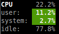
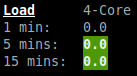
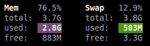
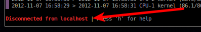

=======
Glances
=======

This manual describes *Glances* version 1.7.4.

Copyright © 2012-2014 Nicolas Hennion <nicolas@nicolargo.com>

January 2014

.. contents:: Table of Contents

Introduction
============

Glances is a cross-platform curses-based monitoring tool which aims to
present a maximum of information in a minimum of space, ideally to fit
in a classical 80x24 terminal or higher to have additional information.

Glances can adapt dynamically the displayed information depending on the
terminal size. It can also work in a client/server mode for remote monitoring.

Glances is written in Python and uses the `psutil`_ library to get information from your system.

Console (80x24)

.. image:: images/screenshot.png

Full view (>80x24)

.. image:: images/screenshot-wide.png

Usage
=====

Standalone mode
---------------

Simply run:

.. code-block:: console

    $ glances

Client/Server mode
------------------

If you want to remotely monitor a machine, called ``server``, from another one, called ``client``,
just run on the server:

.. code-block:: console

    server$ glances -s

and on the client:

.. code-block:: console

    client$ glances -c @server

where ``@server`` is the IP address or hostname of the server.

In server mode, you can set the bind address ``-B ADDRESS`` and listening TCP port ``-p PORT``.

In client mode, you can set the TCP port of the server ``-p PORT``.

Default binding address is ``0.0.0.0`` (Glances will listen on all the network interfaces) and TCP port is ``61209``.

In client/server mode, limits are set by the server side.

You can also set a password to access to the server ``-P password``.

Glances is ``IPv6`` compatible. Just use the ``-B ::`` option to bind to all IPv6 addresses.

Command reference
=================

Command-line options
--------------------

-b             Display network rate in Byte per second (default: bit per second)
-B IP          Bind server to the given IPv4/IPv6 address or hostname
-c IP          Connect to a Glances server by IPv4/IPv6 address or hostname
-C FILE        Path to the configuration file
-d             Disable disk I/O module
-e             Enable sensors module (requires pysensors, Linux-only)
-f FILE        Set the HTML output folder or CSV file
-h             Display the help and exit
-m             Disable mount module
-n             Disable network module
-o OUTPUT      Define additional output (available: HTML or CSV)
-p PORT        Define the client/server TCP port (default: 61209)
-P PASSWORD    Define a client/server password
--password     Define a client/server password from the prompt
-r             Disable process list (for low CPU consumption)
-s             Run Glances in server mode
-t SECONDS     Set refresh time in seconds (default: 3 sec)
-v             Display the version and exit
-y             Enable hddtemp module (requires hddtemp)
-z             Do not use the bold color attribute
-1             Start Glances in per-CPU mode

Interactive commands
--------------------

The following commands (key pressed) are supported while in Glances:

``a``
    Sort process list automatically

    - If CPU iowait ``>60%``, sort processes by I/O read and write
    - If CPU ``>70%``, sort processes by CPU usage
    - If MEM ``>70%``, sort processes by memory usage
``b``
    Switch between bit/s or Byte/s for network I/O
``c``
    Sort processes by CPU usage
``d``
    Show/hide disk I/O stats
``f``
    Show/hide file system stats
``h``
    Show/hide the help screen
``i``
    Sort processes by I/O rate (may need root privileges on some OSes)
``l``
    Show/hide log messages
``m``
    Sort processes by MEM usage
``n``
    Show/hide network stats
``p``
    Sort processes by name
``q``
    Quit
``s``
    Show/hide sensors stats (only available with -e flag)
``t``
    View network I/O as combination
``u``
    View cumulative network I/O
``w``
    Delete finished warning log messages
``x``
    Delete finished warning and critical log messages
``y``
    Show/hide hddtemp stats (only available with -y flag)
``1``
    Switch between global CPU and per-CPU stats

Configuration
=============

No configuration file is mandatory to use Glances.

Furthermore a configuration file is needed for setup limits, disks or network interfaces to hide and/or monitored processes list.

By default, the configuration file is under:

:Linux: ``/etc/glances/glances.conf``
:\*BSD and OS X: ``/usr/local/etc/glances/glances.conf``
:Windows: ``%APPDATA%\glances\glances.conf``

On Windows XP, the ``%APPDATA%`` path is:

.. code-block:: console

    C:\Documents and Settings\<User>\Application Data

Since Windows Vista and newer versions:

.. code-block:: console

    C:\Users\<User>\AppData\Roaming

You can override the default configuration, located in one of the above
directories on your system, except for Windows.

Just copy the ``glances.conf`` file to your ``$XDG_CONFIG_HOME`` directory, e.g. Linux:

.. code-block:: console

    mkdir -p $XDG_CONFIG_HOME/glances
    cp /etc/glances/glances.conf $XDG_CONFIG_HOME/glances/

On OS X, you should copy the configuration file to ``~/Library/Application Support/glances/``.

Anatomy of the application
==========================

Legend
------

| ``GREEN`` stat counter is ``"OK"``
| ``BLUE`` stat counter is ``"CAREFUL"``
| ``MAGENTA`` stat counter is ``"WARNING"``
| ``RED`` stat counter is ``"CRITICAL"``

Header
------

The header shows the hostname, OS name, release version, platform architecture and system uptime.
On Linux, it shows also the kernel version.

CPU
---

Short view:

If enough horizontal space is available, extended CPU informations are displayed.

Extended view:

.. image:: images/cpu-wide.png

To switch to per-CPU stats, just hit the ``1`` key:

.. image:: images/per-cpu.png

The CPU stats are shown as a percentage and for the configured refresh time.
The total CPU usage is displayed on the first line.

| If user|system|nice CPU is ``<50%``, then status is set to ``"OK"``
| If user|system|nice CPU is ``>50%``, then status is set to ``"CAREFUL"``
| If user|system|nice CPU is ``>70%``, then status is set to ``"WARNING"``
| If user|system|nice CPU is ``>90%``, then status is set to ``"CRITICAL"``

*Note*: limit values can be overwritten in the configuration file under the ``[cpu]`` section.

Load
----

On the *No Sheep* blog, *Zachary Tirrell* defines the average load [1]_:

    "In short it is the average sum of the number of processes
    waiting in the run-queue plus the number currently executing
    over 1, 5, and 15 minute time periods."

Glances gets the number of CPU core to adapt the alerts.
Alerts on average load are only set on 5 and 15 min.
The first line also display the number of CPU core.

| If average load is ``<0.7*core``, then status is set to ``"OK"``
| If average load is ``>0.7*core``, then status is set to ``"CAREFUL"``
| If average load is ``>1*core``, then status is set to ``"WARNING"``
| If average load is ``>5*core``, then status is set to ``"CRITICAL"``

*Note*: limit values can be overwritten in the configuration file under the ``[load]`` section.

Memory
------

Glances uses two columns: one for the ``RAM`` and another one for the ``Swap``.

If enough space is available, Glances displays extended informations:

.. image:: images/mem-wide.png

With Glances, alerts are only set for on used memory and used swap.

| If memory is ``<50%``, then status is set to ``"OK"``
| If memory is ``>50%``, then status is set to ``"CAREFUL"``
| If memory is ``>70%``, then status is set to ``"WARNING"``
| If memory is ``>90%``, then status is set to ``"CRITICAL"``

*Note*: limit values can be overwritten in the configuration file under the ``[memory]`` and ``[swap]`` sections.

Network
-------

.. image:: images/network.png

Glances displays the network interface bit rate. The unit is adapted
dynamically (bits per second, kbits per second, Mbits per second, etc).

Alerts are only set if the network interface maximum speed is available.

For example, on a 100 Mbps ethernet interface, the warning status is set
if the bit rate is higher than 70 Mbps.

| If bit rate is ``<50%``, then status is set to ``"OK"``
| If bit rate is ``>50%``, then status is set to ``"CAREFUL"``
| If bit rate is ``>70%``, then status is set to ``"WARNING"``
| If bit rate is ``>90%``, then status is set to ``"CRITICAL"``

*Note*: In the configuration file, you can define a list of network interfaces to hide.

Sensors
-------

Glances can displays the sensors informations trough `lm-sensors` (only available on Linux).

As of lm-sensors, a filter is processed in order to display temperature only:

.. image:: images/sensors.png

Glances can also grab hard disk temperature through the `hddtemp` daemon (see here [2]_ to install hddtemp on your system):

.. image:: images/hddtemp.png

To enable the lm-sensors module:

.. code-block:: console

    $ glances -e

To enable the hddtemp module:

.. code-block:: console

    $ glances -y

There is no alert on this information.

*Note*: limit values can be overwritten in the configuration file under the ``[temperature]`` and ``[hddtemperature]`` sections.

Disk I/O
--------

.. image:: images/diskio.png

Glances displays the disk I/O throughput. The unit is adapted dynamically.

*Note*: There is no alert on this information.

*Note*: In the configuration file, you can define a list of disk to hide.

File system
-----------

.. image:: images/fs.png

Glances displays the used and total file system disk space. The unit is
adapted dynamically.

Alerts are set for used disk space:

| If disk used is ``<50%``, then status is set to ``"OK"``
| If disk used is ``>50%``, then status is set to ``"CAREFUL"``
| If disk used is ``>70%``, then status is set to ``"WARNING"``
| If disk used is ``>90%``, then status is set to ``"CRITICAL"``

*Note*: limit values can be overwritten in the configuration file under ``[filesystem]`` section.

Processes list
--------------

Compact view:

.. image:: images/processlist.png

Full view:

.. image:: images/processlist-wide.png

Three views are available for processes:

* Processes summary
* Optional monitored processes list (new in 1.7)
* Processes list

The processes summary line display:

* Tasks number (total number of processes)
* Threads number 
* Running tasks number
* Sleeping tasks number
* Other tasks number (not running or sleeping)

By default, or if you hit the ``a`` key, the processes list is automatically
sorted by CPU of memory usage.

*Note*: limit values can be overwritten in the configuration file under the ``[process]`` section.

The number of processes in the list is adapted to the screen size.

``VIRT``
    Total program size (VMS)
``RES``
    Resident set size (RSS)
``CPU%``
    % of CPU used by the process
``MEM%``
    % of MEM used by the process
``PID``
    Process ID
``USER``
    User ID per process
``NI``
    Nice level of the process
``S``
    Process status
``TIME+``
    Cumulative CPU time used
``IOR/s``
    Per process IO read rate (in Byte/s)
``IOW/s``
    Per process IO write rate (in Byte/s)
``NAME``
    Process name or command line

Process status legend:

``R``
    running
``S``
    sleeping (may be interrupted)
``D``
    disk sleep (may not be interrupted)
``T``
    traced/stopped
``Z``
    zombie

Monitored processes list
------------------------

New in version 1.7. Optional.

The monitored processes list allows user, through the configuration file,
to group processes and quickly show if the number of running process is not good.

.. image:: images/monitored.png

Each item is defined by:

* ``description``: description of the processes (max 16 chars).
* ``regex``: regular expression of the processes to monitor.
* ``command`` (optional): full path to shell command/script for extended stat. Should return a single line string. Use with caution.
* ``countmin`` (optional): minimal number of processes. A warning will be displayed if number of processes < count.
* ``countmax`` (optional): maximum number of processes. A warning will be displayed if number of processes > count.

Up to 10 items can be defined.

For example, if you want to monitor the Nginx processes on a Web server, the following definition should do the job:

.. code-block:: console

    [monitor]
    list_1_description=Nginx server
    list_1_regex=.*nginx.*
    list_1_command=nginx -v
    list_1_countmin=1
    list_1_countmax=4

If you also want to monitor the PHP-FPM daemon processes, you should add another item:

.. code-block:: console

    [monitor]
    list_1_description=Nginx server
    list_1_regex=.*nginx.*
    list_1_command=nginx -v
    list_1_countmin=1
    list_1_countmax=4
    list_1_description=PHP-FPM
    list_1_regex=.*php-fpm.*
    list_1_countmin=1
    list_1_countmax=20

In client/server mode, the list is defined on the server side.
A new method, called getAllMonitored, is available in the APIs and get the JSON representation of the monitored processes list.

Alerts are set as following:

| If number of processes is 0, then status is set to ``"CRITICAL"``
| If number of processes is min < current < max, then status is set to ``"OK"``
| Else status is set to ``"WARNING"``

Logs
----

.. image:: images/logs.png

A log messages list is displayed in the bottom of the screen if (and only if):

- at least one ``WARNING`` or ``CRITICAL`` alert was occurred
- space is available in the bottom of the console/terminal

Each alert message displays the following information:

1. start date
2. end date
3. alert name
4. {min/avg/max} values or number of running processes for monitored processes list alerts

Footer
------

.. image:: images/footer.png

Glances displays the current date & time and access to the embedded help screen.

If one or mode batteries were found on your machine and if the batinfo Python library [3]_
is installed on your system then Glances displays the available percent capacity in the middle on the footer.

.. image:: images/battery.png

If you have ran Glances in client mode ``-c``, you can also see if the client is connected to the server.

If client is connected:

.. image:: images/client-connected.png

else:

On the left, you can easily see if you are connected to a Glances server.

API documentation
=================

Glances uses a `XML-RPC server`_ and can be used by another client software.

API documentation is available at https://github.com/nicolargo/glances/wiki/The-Glances-API-How-To

Others outputs
==============

Thanks to the -o option, it is possible to export statistics to CSV or HTML files.

.. code-block:: console

    $ glances -o CSV -f /tmp/glances.csv

CSV files have on line per stats:

- load,load1,load5,load15
- mem,total,used,free
- swap,total,used,free
- cpu,user,system,nice,idel,iowait,irq

.. code-block:: console

    $ glances -o HTML -f /tmp

Note: The css and img folders (glances/data) should be in the /tmp folder

Support
=======

To report a bug or a feature request use the bug tracking system at https://github.com/nicolargo/glances/issues

Feel free to contribute!

.. [1] http://nosheep.net/story/defining-unix-load-average/
.. [2] http://www.cyberciti.biz/tips/howto-monitor-hard-drive-temperature.html
.. [3] https://github.com/nicolargo/batinfo

.. _psutil: https://code.google.com/p/psutil/
.. _XML-RPC server: http://docs.python.org/2/library/simplexmlrpcserver.html
