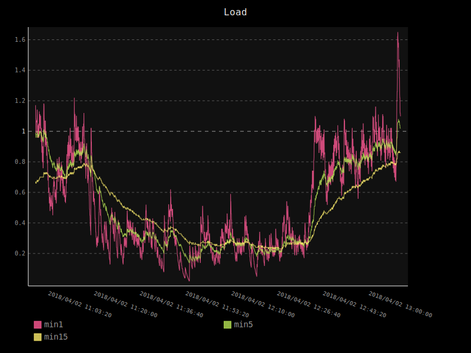

.. _graph:

Graph
======

You can generate dynamic graphs (SVG format) in a target folder. The generation
starts every time the 'g' key is pressed in the CLI interface (if Glances has been
started with the --export graph option).

The graph export module can be configured through the Glances configuration file:

.. code-block:: ini

    [graph]
    # Configuration for the --export graph option
    # Set the path where the graph (.svg files) will be created
    # Can be overwrite by the --graph-path command line option
    path=/tmp
    # It is possible to generate the graphs automatically by setting the
    # generate_every to a non zero value corresponding to the seconds between
    # two generation. Set it to 0 to disable graph auto generation.
    generate_every=60
    # See following configuration keys definitions in the Pygal lib documentation
    # http://pygal.org/en/stable/documentation/index.html
    width=800
    height=600
    style=DarkStyle

and run Glances with:

.. code-block:: console

    $ glances --export graph --export-graph-path /tmp

Example of output (load graph)

