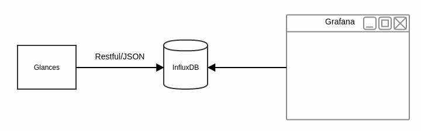
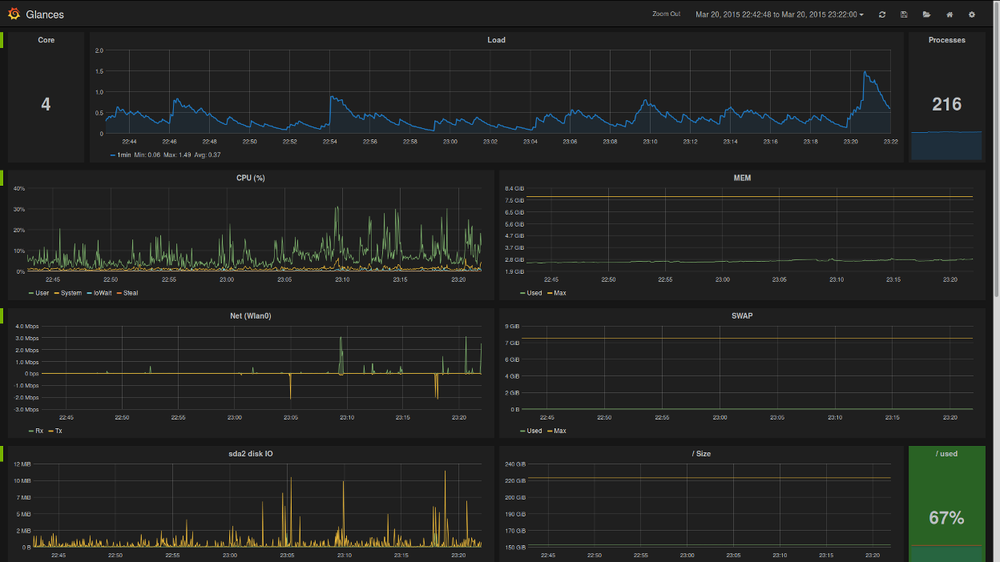

.. _influxdb:

InfluxDB
========

You can export statistics to an ``InfluxDB`` server (time series server).

In Glances version 3.2.0 and higher, the way Glances exports stats to
InfluxDB changes. The following fields will be added as tags:

- key stats (for example *interface_name* for network, container *name* for docker...)
- hostname (shortname)
- tags

Glances InfluxDB data model:

+---------------+-----------------------+-----------------------+
| Measurement   | Fields                | Tags                  |
+===============+=======================+=======================+
| cpu           | user                  | hostname              |
|               | system                |                       |
|               | iowait...             |                       |
+---------------+-----------------------+-----------------------+
| network       | read_bytes            | hostname              |
|               | write_bytes           | disk_name             |
|               | time_since_update...  |                       |
|               |                       |                       |
+---------------+-----------------------+-----------------------+
| diskio        | rx                    | hostname              |
|               | tx                    | interface_name        |
|               | time_since_update...  |                       |
|               |                       |                       |
+---------------+-----------------------+-----------------------+
| docker        | cpu_percent           | hostname              |
|               | memory_usage...       | name                  |
+---------------+-----------------------+-----------------------+
| gpu           | proc                  | hostname              |
|               | mem                   | gpu_id                |
|               | temperature...        |                       |
+---------------+-----------------------+-----------------------+

InfluxDB (up to version 1.7.x)
------------------------------

The connection should be defined in the Glances configuration file as
following:

.. code-block:: ini

    [influxdb]
    host=localhost
    port=8086
    protocol=http
    user=root
    password=root
    db=glances
    # Prefix will be added for all measurement name
    # Ex: prefix=foo
    #     => foo.cpu
    #     => foo.mem
    # You can also use dynamic values
    #prefix=foo
    # Following tags will be added for all measurements
    # You can also use dynamic values.
    # Note: hostname is always added as a tag
    #tags=foo:bar,spam:eggs,domain:`domainname`

and run Glances with:

.. code-block:: console

    $ glances --export influxdb

Glances generates a lot of columns, e.g., if you have many running
Docker containers, so you should use the ``tsm1`` engine in the InfluxDB
configuration file (no limit on columns number).

Note: if you want to use SSL, please set 'protocol=https'.

InfluxDB v2 (from InfluxDB v1.8.x/Flux and InfluxDB v2.x)
---------------------------------------------------------

Note: The InfluxDB v2 client (https://pypi.org/project/influxdb-client/)
is only available for Python 3.6 or higher.

The connection should be defined in the Glances configuration file as
following:

.. code-block:: ini

    [influxdb2]
    host=localhost
    port=8086
    protocol=http
    org=nicolargo
    bucket=glances
    token=EjFUTWe8U-MIseEAkaVIgVnej_TrnbdvEcRkaB1imstW7gapSqy6_6-8XD-yd51V0zUUpDy-kAdVD1purDLuxA==
    # Set the interval between two exports (in seconds)
    # If the interval is set to 0, the Glances refresh time is used (default behavor)
    #interval=0
    # Prefix will be added for all measurement name
    # Ex: prefix=foo
    #     => foo.cpu
    #     => foo.mem
    # You can also use dynamic values
    #prefix=foo
    # Following tags will be added for all measurements
    # You can also use dynamic values.
    # Note: hostname is always added as a tag
    #tags=foo:bar,spam:eggs,domain:`domainname`

and run Glances with:

.. code-block:: console

    $ glances --export influxdb2

Note: if you want to use SSL, please set 'protocol=https'.

Grafana
-------

For Grafana users, Glances provides a dedicated for `InfluxQL`_ or `Flux`_ InfluxDB datasource.

To use it, just import the file in your ``Grafana`` web interface.

.. _InfluxQL: https://github.com/nicolargo/glances/blob/master/conf/glances-grafana-influxql.json
.. _Flux: https://github.com/nicolargo/glances/blob/master/conf/glances-grafana-flux.json
