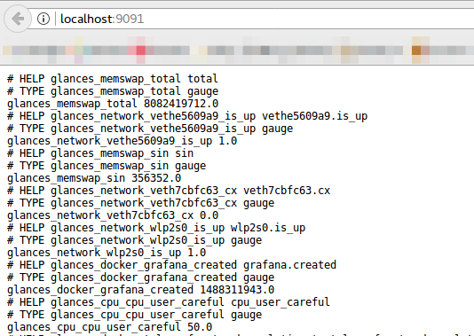
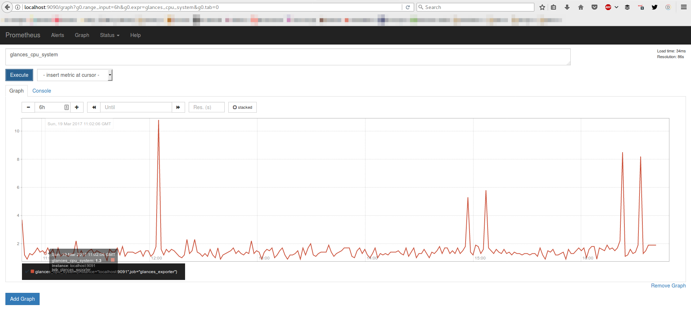

.. _prometheus:

Prometheus
==========

You can export statistics to a ``Prometheus`` server through an exporter.
When the *--export prometheus* is used, Glances creates a Prometheus exporter
listening on <host:port> (defined in the Glances configuration file).

.. code-block:: ini

    [prometheus]
    host=localhost
    port=9091
    prefix=glances
    labels=src:glances

.. note::

    When running Glances in a container, set ``host=0.0.0.0`` in the Glances configuration file.

.. note::

    You can use dynamic fields for the label (ex: labels=system:`uname -s`)

and run Glances with:

.. code-block:: console

    $ glances --export prometheus

You can check that Glances exports the stats using this URL: http://localhost:9091

In order to store the metrics in a Prometheus server, you should add this
exporter to your Prometheus server configuration with the following lines
(in the prometheus.yml configuration file):

.. code-block:: ini

    scrape_configs:
      - job_name: 'glances_exporter'
        scrape_interval: 5s
        static_configs:
          - targets: ['localhost:9091']

