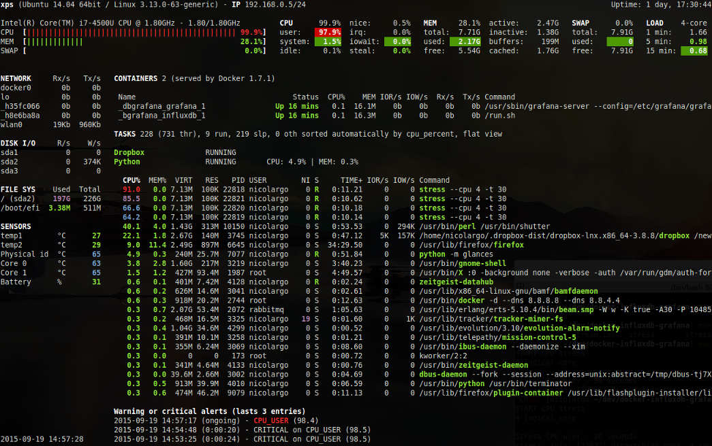
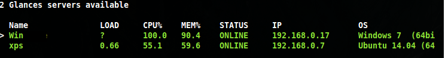
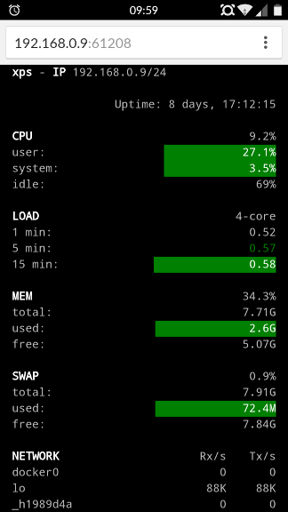

.. _quickstart:

Quickstart
==========

This page gives a good introduction to how to get started with Glances.
Glances offers three modes:

- Standalone
- Client/Server
- Web server

Standalone Mode
---------------

If you want to monitor your local machine, open a console/terminal
and simply run:

.. code-block:: console

    $ glances

Glances should start (press 'q' or 'ESC' to exit):

It is also possible to display RAW (Python) stats directly to stdout using:

.. code-block:: console

    $ glances --stdout cpu.user,mem.used,load,network.wlp2s0.bytes_all
    cpu.user: 30.7
    mem.used: 3278204928
    load: {'cpucore': 4, 'min1': 0.21, 'min5': 0.4, 'min15': 0.27}
    network.wlp2s0.bytes_all: 13479
    cpu.user: 3.4
    mem.used: 3275251712
    load: {'cpucore': 4, 'min1': 0.19, 'min5': 0.39, 'min15': 0.27}
    network.wlp2s0.bytes_all: 12868
    ...

or in a CSV format thanks to the stdout-csv option (key not supported in this mode):

.. code-block:: console

    $ glances --stdout-csv now,cpu.user,mem.used,load
    now,cpu.user,mem.used,load.cpucore,load.min1,load.min5,load.min15
    2018-12-08 22:04:20 CEST,7.3,5948149760,4,1.04,0.99,1.04
    2018-12-08 22:04:23 CEST,5.4,5949136896,4,1.04,0.99,1.04
    ...

or as a JSON format thanks to the stdout-json option (attribute not supported in this mode):

.. code-block:: console

    $ glances --stdout-json cpu,mem
    cpu: {"total": 29.0, "user": 24.7, "nice": 0.0, "system": 3.8, "idle": 71.4, "iowait": 0.0, "irq": 0.0, "softirq": 0.0, "steal": 0.0, "guest": 0.0, "guest_nice": 0.0, "time_since_update": 1, "cpucore": 4, "ctx_switches": 0, "interrupts": 0, "soft_interrupts": 0, "syscalls": 0}
    mem: {"total": 7837949952, "available": 2919079936, "percent": 62.8, "used": 4918870016, "free": 2919079936, "active": 2841214976, "inactive": 3340550144, "buffers": 546799616, "cached": 3068141568, "shared": 788156416}
    ...

Note: It will display one line per stat per refresh.

Client/Server Mode
------------------

If you want to remotely monitor a machine called ``server``, from
another one, called ``client``, just run on the server:

.. code-block:: console

    server$ glances -s

and on the client:

.. code-block:: console

    client$ glances -c @server

where ``@server`` is the IP address or hostname of the server.

In server mode, you can set the bind address with ``-B ADDRESS`` and
the listening TCP port with ``-p PORT``.

In client mode, you can set the TCP port of the server with ``-p PORT``.

Default binding address is ``0.0.0.0`` (Glances will listen on all the
available network interfaces) and TCP port is ``61209``.

In client/server mode, limits are set by the server side.

Central Glances Browser
^^^^^^^^^^^^^^^^^^^^^^^

Glances can centralize available Glances servers using the ``--browser``
option. The server list can be statically defined via the configuration
file (section ``[serverlist]``).

Example:

.. code-block:: ini

    [serverlist]
    # Define columns (comma separated list of <plugin>:<field>:(<key>)) to grab/display
    # Default is: system:hr_name,load:min5,cpu:total,mem:percent
    # You can also add stats with key, like sensors:value:Ambient (key is case sensitive)
    columns=system:hr_name,load:min5,cpu:total,mem:percent,memswap:percent
    # Define the static servers list
    server_1_name=xps
    server_1_alias=xps
    server_1_port=61209
    server_2_name=win
    server_2_port=61235

Glances can also detect and display all Glances servers available on
your network via the ``zeroconf`` protocol (not available on Windows):

To start the TUI Central Glances Browser, use the following option:

.. code-block:: console

    client$ glances --browser

When the list is displayed, you can navigate through the Glances servers with
up/down keys. It is also possible to sort the server using:
- '1' is normal (do not sort)
- '2' is using sorting with ascending order (ONLINE > SNMP > PROTECTED > OFFLINE > UNKNOWN)
- '3' is using sorting with descending order (UNKNOWN > OFFLINE > PROTECTED > SNMP > ONLINE)

To start the WebUI Central Glances Browser (new in Glances 4.3 or higher), use the following option:

.. code-block:: console

    client$ glances --browser -w

Open the URL (/browser) and click on the server to display stats.

.. note::

    Use ``--disable-autodiscover`` to disable the auto-discovery mode.

SNMP
^^^^

As an experimental feature, if Glances server is not detected by the
client, the latter will try to grab stats using the ``SNMP`` protocol:

.. code-block:: console

    client$ glances -c @snmpserver

.. note::
    Stats grabbed by SNMP request are limited and OS-dependent.
    A SNMP server should be installed and configured...

IPv6
^^^^

Glances is ``IPv6`` compatible. Just use the ``-B ::`` option to bind to
all IPv6 addresses.

Web Server Mode
---------------

.. image:: _static/screenshot-web.png

If you want to remotely monitor a machine called ``server``, from any
device with a web browser, just run the server with the ``-w`` option:

.. code-block:: console

    server$ glances -w

then, on the client, enter the following URL in your favorite web browser:

::

    http://@server:61208

where ``@server`` is the IP address or hostname of the server.

To change the refresh rate of the page, add the period in seconds
at the end of the URL. For example, to refresh the page every ``10``
seconds:

::

    http://@server:61208/10

The Glances web interface follows responsive web design principles.

Here's a screenshot from Chrome on Android:

How do you protect your server (or Web server) with a login/password ?
------------------------------------------------------------------

You can set a password to access the server using the ``--password``.
By default, the login is ``glances`` but you can change it with
``--username``.

If you want, the SHA password will be stored in ``<login>.pwd`` file (in
the same folder where the Glances configuration file is stored, so
~/.config/glances/ on GNU Linux operating system).

Next time you run the server/client, password will not be asked. To set a
specific username, you can use the -u <username> option.

It is also possible to set the default password in the Glances configuration
file:

.. code-block:: ini

    [passwords]
    # Define the passwords list
    # Syntax: host=password
    # Where: host is the hostname
    #        password is the clear password
    # Additionally (and optionally) a default password could be defined
    localhost=mylocalhostpassword
    default=mydefaultpassword
